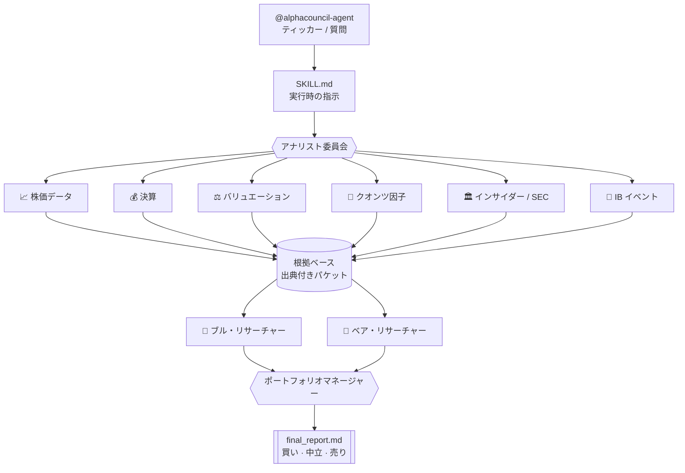

<a name="readme-top"></a>

<div align="center">


### ターミナルの中の、マルチエージェント投資委員会

アナリスト評議会を招集 → 出典付きの根拠を収集 → 強気/弱気ディベート → PM が判定:**買い · オーバーウェイト · 中立 · アンダーウェイト · 売り**

[English](README.md) · [中文](README.zh-CN.md) · **日本語**

<p>
  
  
  
  
</p>
<p>
  
  
  
</p>

<p>
  <a href="#-使い方"><b>使い方</b></a> ·
  <a href="docs/INSTALL.md"><b>インストール</b></a> ·
  <a href="#-アーキテクチャ"><b>アーキテクチャ</b></a> ·
  <a href="#-免責事項"><b>免責事項</b></a>
</p>

</div>

---

<div align="center">


<sub><i>コマンド一発 → アナリスト評議会 → 強気/弱気ディベート → PM の判定。</i></sub>

</div>

AlphaCouncil Agent は、**上場株式のリサーチ**向けの Codex / Claude Code プラグインです。複数のアナリスト・サブエージェントを統括し、出典付きの根拠を集め、強気/弱気のディベートを行い、ポートフォリオマネージャー視点の最終レポートを生成します。

### ✨ AlphaCouncil を使う理由

| | |
|---|---|
| 🏛️ **一人の意見ではなく、委員会** | 11 の専門アナリストエージェント(株価・決算・バリュエーション・クオンツ・インサイダー/SEC・IB イベント…)が並列で稼働。 |
| 🐂🐻 **設計からして対立的** | 構造化された強気 vs 弱気のディベートを、PM エージェントが裁定し実際のレーティングを提示。 |
| 🔍 **監査可能、幻覚なし** | すべての主張が source ID に紐づく。欠落データは「データ欠落」セクションに明示し、決して隠さない。 |
| ⏱️ **マルチ期間の判定** | 買い/中立/売りに加え、1〜4週・3〜6か月・12か月の見通しを個別に提示。 |
| 🔑 **データベンダー不要・APIキー不要** | 金融データ API・マーケットデータフィード・証券口座ログインは一切不要。アナリストはエージェント自身のウェブ検索(**Codex のウェブ検索** / **Claude Code の WebSearch + WebFetch**)で根拠をリアルタイムに収集 —— 課金は既存の Codex / Claude Code サブスクのみ。MIT ライセンス。 |
| 📚 **同梱の調査プレイブック** | 公開株式投資と投資銀行イベント分析の方法論を**ローカルスキル**として同梱(`skills/public-equity-investing`、`skills/investment-banking`)—— Codex 専用のリモートワークフローに依存せず、Claude Code でも同等の調査深度。 |

このリポジトリはアップロード用のソースコピーです。実行成果物はリポジトリの外、`~/.alphacouncil-agent/runs/<run_id>/` に書き出されます。

## 📜 免責事項

本ソフトウェアは**教育・研究目的のみ**を対象としており、**投資助言ではありません**。いかなる証券の売買の推奨・勧誘でもありません。AI が生成する分析は不完全・古い・誤っている可能性があります。投資判断の前に、必ずご自身で調査し、有資格の専門家にご相談ください。作者はいかなる損失についても責任を負いません。

## インストール

Codex と Claude Code の完全なセットアップ手順は **[docs/INSTALL.md](docs/INSTALL.md)** を参照してください。**Windows ユーザー**は [Windows セクション](docs/INSTALL.md#windows) を参照。

**前提条件:** Node.js ≥ 18。headless でリサーチを実走させるには、**インストール済みかつ認証済みの Codex CLI** も必要です(各アナリスト worker は `codex exec` として起動します)。Codex が無い場合は、インストールガイドの **visible ワークフロー**を使ってください。

```text
# Codex
codex plugin marketplace add Zhao73/alphacouncil-agent
# その後 codex → /plugins でインストール → /reload-plugins

# Claude Code
/plugin marketplace add Zhao73/alphacouncil-agent
/plugin install alphacouncil-agent@alphacouncil
/reload-plugins
```

## 🚀 使い方

エージェントにそのまま話しかけるだけ。@ でエージェントを呼び、ティッカーや質問を添えます:

```text
@alphacouncil-agent NVDA をロング/ショートのピッチとして分析して
@alphacouncil-agent 現在の水準で AAPL は買い?
@alphacouncil-agent 12か月の視点で TSLA と RIVN を比較して
@alphacouncil-agent トヨタ(7203)を分析して
@alphacouncil-agent 帮我看看 700.HK 现在能不能买
```

チャット上でそのまま読める 1 本のレポートが返ってきます:

```text
判定:オーバーウェイト  (確信度:中)
├─ アナリスト作業ログ .... 11 の根拠エージェント、出典付き主張 38 件
├─ 強気シナリオ .......... 需要の転換点、マージン拡大、自社株買い
├─ 弱気シナリオ .......... バリュエーション、顧客集中、サイクルリスク
├─ 短期 / 中期 / 長期 .... 1〜4週 · 3〜6か月 · 12か月の見通し
├─ カタリストとリスク .... 決算、ガイダンス、規制
├─ データの欠落 .......... 明示的に列挙し、決して隠さない
└─ 出典テーブル .......... すべての主張を <task>:<source_id> に対応付け
```

簡潔なユーザー向け要約は `~/.alphacouncil-agent/runs/<run_id>/user_response.md` に書き出されます。
完全なレポートは `~/.alphacouncil-agent/runs/<run_id>/final_report.md` に書き出され、
同じディレクトリに各アナリストの Markdown ファイルと `artifact_index.md` も保存されます。

## 何ができるか

デフォルトの個別銘柄分析は、要約版ではなく**フルラン**です:

- 株価データと値動き
- 決算のディープダイブ
- 将来予想と、織り込まれた beat/miss の閾値
- セルサイドのレーティング・目標株価の改定
- 決算電話会議における経営陣のシグナル
- クオンツ・ファクター視点:モメンタム、トレンド、ボラティリティ、出来高/流動性、相対的強さ、空売り残高、貸株、(取得可能な場合)オプションの IV/スキュー/予想変動幅
- バリュエーションとロング/ショートのピッチ
- ニュース、業界背景、CEO/経営陣および公開された業界人の発言
- SEC 提出書類、Form 4(インサイダー取引)、自社株買い、希薄化、負債、資本配分
- M&A・増資・負債・自社株買い・戦略的取引に関する投資銀行イベント分析
- ブル・リサーチャー、ベア・リサーチャー、ポートフォリオマネージャーによる統合

最終レポートはチャット上でそのまま読み切れることが要件で、アナリスト作業ログ、データ/ニュース/書類の要約、強気/弱気ディベート、PM の結論、短期/中期/長期の見解、データの欠落、確信度、出典テーブルを含みます。

## 🧩 アーキテクチャ



主要ファイル:

- `.codex-plugin/plugin.json` —— Codex プラグインのメタデータ
- `.claude-plugin/plugin.json` —— Claude Code プラグインのマニフェスト
- `.mcp.json` —— MCP server の配線
- `skills/alphacouncil-agent/SKILL.md` —— 実行時の指示
- `mcp/server.mjs` —— JSON-RPC MCP server とワークフロー実装
- `scripts/selfcheck.mjs` —— 最小限の回帰セルフチェック

## 🆚 Codex 版 vs Claude Code 版

両版はワークフロー、JSON パケット契約、監査用成果物、API キー不要のライブ Web 取証モデル、免責事項を共有します。Claude Code 版は委員会の「**動かし方**」だけを変えます。

| | Codex 版 | Claude Code 版 |
|---|---|---|
| 委員会の実行 | `codex exec` ワーカー、同時実行に上限 | 11 アナリストを並列 `Task` サブエージェントとして一括起動 |
| アナリストごとの文脈 | 別プロセス | 別サブエージェント、それぞれ独立した完全な文脈ウィンドウ |
| 取証 | `codex exec --search` | 各アナリスト自身の文脈で `WebSearch` + `WebFetch` |
| 根拠 → ディベート | 逐次 | 実行フェーズマシンによるハードバリア |
| ディベートの深さ | 3 ラウンド(主張/反論/Q&A)、server 実行 | 3 ラウンド、各ラウンドで強気・弱気を並列 |
| 主張の検証 | 欠落ソースゲート(実行にフラグ + レポートにバナー) | + 主張ごとの敵対的検証:引用 URL の再取得・再導出・反証 *(ホスト駆動)* |
| 完全実行の強制 | 不完全な実行を `incomplete` とマーク(server ゲート) | 同ゲート + ディベート前のハードバリア |
| モデルとコスト | 単一モデル | **役割ごとに選択** — 取証は Sonnet、ディベート/判定は Opus 4.8(全 Opus / 全 Sonnet も可) |
| 言語 | ユーザーの言語 | 全サブエージェント + ライブ workflow を通じてユーザーの言語 |

**正直なスコープ:** 同じモデルファミリー・同じプロンプト・同じ監査契約 —— 強みは文脈の分離、常時並列ファンアウト、決定的ゲートであり、より賢いモデルではありません。**v0.3.0** 以降、共有 server は 3 ラウンドのディベート、「欠落ソース / 完全実行 / レポート品質」のゲート、簡潔な引き渡し要約、完全レポート、ファイル索引、Windows ネイティブ Codex CLI 起動を提供します。**v0.3.1** 以降、`addyosmani/agent-skills` スタイルの停止ゲートと完了基準を持つ `agent-skills-governance` skill も同梱します。Claude Code 版はさらにラウンドごとの並列実行とホスト駆動の主張ごと検証を追加します。ライブ Web の鮮度とペイウォールは両版に等しく当てはまります。

## データ契約

根拠サブエージェントは JSON パケットを返します:

```json
{
  "task": "market_data",
  "symbol": "NVDA",
  "as_of": "YYYY-MM-DD",
  "summary": "string",
  "claims": [
    { "claim": "string", "evidence": "string", "confidence": "high|medium|low", "source_ids": ["market_data:S1"] }
  ],
  "metrics": {},
  "sources": [
    { "id": "market_data:S1", "title": "string", "url": "https://example.com", "published_at": "YYYY-MM-DD or unknown", "retrieved_at": "YYYY-MM-DD" }
  ],
  "open_questions": ["missing data item"],
  "confidence": "high|medium|low"
}
```

すべての source ID は `<task>:<source_id>` のグローバルスコープです。欠落データは `open_questions` に記載し、最終レポートのデータ欠落セクションにも反映する必要があります。

## ローカル実行

```bash
npm run check
```

セルフチェックの検証内容:MCP server の構文、ツール schema の公開、source ID のスコープ、デフォルトの実走挙動、可視ランの記録、`events.jsonl`/`status.json`/`all_agents.md`/`source_manifest.json`、`final_report.md`/`user_response.md`/`artifact_index.md`/`report_quality.json`、アナリスト Markdown ファイル、および最終レポートの必須セクション。

## 備考

これは独立したプラグイン実装で、マルチエージェントの投資委員会ワークフロー(アナリストチーム、根拠の共有、強気/弱気ディベート、ポートフォリオマネージャーによる統合)を採用しています。

API キー、証券口座の認証情報、非公開書類、生成された実行成果物は決してコミットしないでください。

## ⭐ Star 推移

<div align="center">

<a href="https://star-history.com/#Zhao73/alphacouncil-agent&Date">
  
</a>

<br/><br/>

<picture>
  <source media="(prefers-color-scheme: dark)" srcset="assets/logo-dark.png" />
  
</picture>

AlphaCouncil が役に立ったら、⭐ をいただけると励みになります。

<a href="#readme-top">↑ トップに戻る</a>

</div>
