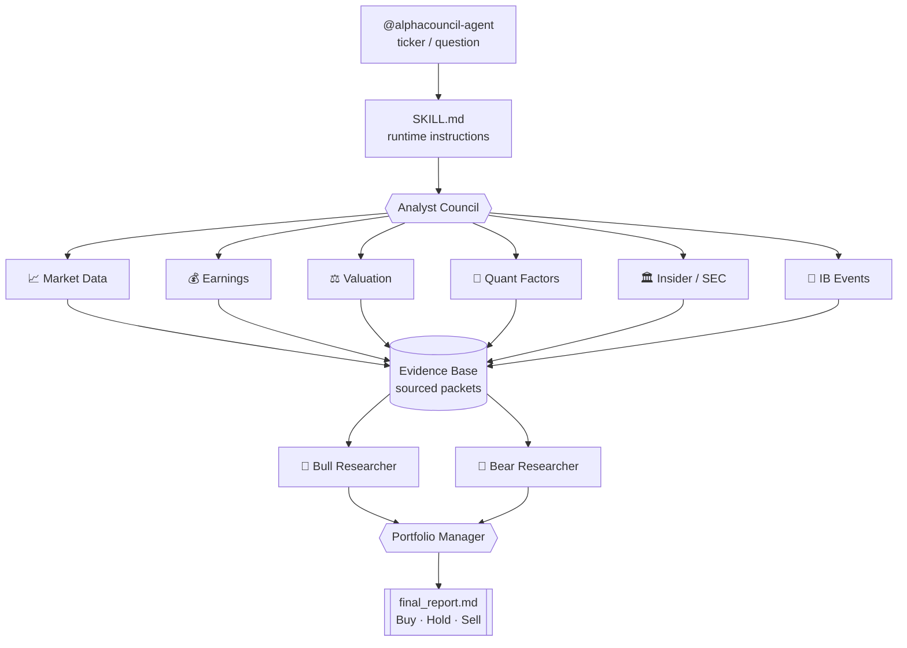

<a name="readme-top"></a>

<div align="center">


<p>
  
</p>

**English** · [中文](README.zh-CN.md) · [日本語](README.ja.md)

<p>
  
  
  
  
</p>
<p>
  
  
  
</p>

<p>
  <a href="#-usage"><b>Usage</b></a> ·
  <a href="docs/INSTALL.md"><b>Install</b></a> ·
  <a href="#-architecture"><b>Architecture</b></a> ·
  <a href="#-disclaimer"><b>Disclaimer</b></a>
</p>

</div>

---

AlphaCouncil Agent is a Codex and Claude Code plugin for full public-equity research workflows. It coordinates multiple analyst agents, gathers sourced evidence, runs bull/bear debate, and produces a portfolio-manager style final report.

### ✨ Why AlphaCouncil

| | |
|---|---|
| 🏛️ **A council, not one opinion** | 11 specialist analyst agents (market data, earnings, valuation, quant, insider/SEC, IB events…) run in parallel. |
| 🐂🐻 **Adversarial by design** | A structured bull vs bear debate, refereed by a portfolio-manager agent that issues an actual rating. |
| 🔍 **Auditable, never hallucinated** | Every claim maps to a source ID. Missing data is listed in a "data gaps" section — never hidden. |
| ⏱️ **Multi-horizon verdict** | Buy/Hold/Sell plus separate 1-4 week, 3-6 month, and 12-month views. |
| 🔑 **No API key** | Rides your existing Codex / Claude Code subscription. MIT licensed. |

This repository is the uploadable source copy. Runtime outputs are written outside the repo under `~/.alphacouncil-agent/runs/<run_id>/`.

## 📜 Disclaimer

This software is for **educational and research purposes only**. It is **not
investment advice**, not a recommendation to buy or sell any security, and not a
solicitation. AI-generated analysis can be incomplete, outdated, or wrong. Do
your own research and consult a licensed financial professional before making any
investment decision. The authors accept no liability for any loss.

## Install

See **[docs/INSTALL.md](docs/INSTALL.md)** for full Codex and Claude Code setup.

**Prerequisites:** Node.js >= 18. The headless research path also needs an
installed, authenticated **Codex CLI** (each analyst worker runs as `codex
exec`); without it, use the visible workflow described in the install guide.

```text
# Codex
codex plugin marketplace add Zhao73/alphacouncil-agent
# then run `codex`, open /plugins, install, and /reload-plugins

# Claude Code
/plugin marketplace add Zhao73/alphacouncil-agent
/plugin install alphacouncil-agent@alphacouncil
/reload-plugins
```

## 🚀 Usage

Just talk to it. Mention the agent and a ticker or a question:

```text
@alphacouncil-agent analyze NVDA as a long/short pitch
@alphacouncil-agent is AAPL a buy at current levels?
@alphacouncil-agent compare TSLA vs RIVN for a 12-month horizon
@alphacouncil-agent 帮我看看 700.HK 现在能不能买
@alphacouncil-agent トヨタ(7203)を分析して
```

You get back a single, chat-readable report:

```text
VERDICT: Overweight  (confidence: medium)
├─ Analyst work log ........ 11 evidence agents, 38 sourced claims
├─ Bull thesis ............. demand inflection, margin expansion, buyback
├─ Bear thesis ............. valuation, customer concentration, cycle risk
├─ Short / medium / long ... 1-4wk · 3-6mo · 12mo views
├─ Catalysts & risks ....... earnings, guidance, regulatory
├─ Data gaps ............... explicitly listed, never hidden
└─ Source table ............ every claim mapped to <task>:<source_id>
```

The full report is also written to `~/.alphacouncil-agent/runs/<run_id>/final_report.md`.

## What It Does

Default stock-analysis runs are full runs, not lite summaries:

- Market data and price action
- Earnings deep dive
- Forward expectations and implied beat/miss thresholds
- Sell-side rating and target-price revisions
- Earnings-call management signals
- Quant factor view: momentum, trend, volatility, volume/liquidity, relative strength, short interest, borrow, option IV/skew/expected move when available
- Valuation and long/short pitch
- News, industry context, CEO/management and public industry voices
- SEC filings, Form 4 insider transactions, buybacks, dilution, debt and capital allocation
- Investment-banking event analysis for M&A, ECM, debt, buyback or strategic transactions
- Bull researcher, bear researcher and portfolio manager synthesis

The final report must be readable directly in chat. It includes analyst work logs, data/news/filing summaries, bull/bear debate, portfolio-manager verdict, short/medium/long-term view, data gaps, confidence and source table.

## 🧩 Architecture



Key files:

- `.codex-plugin/plugin.json` - Codex plugin metadata.
- `.mcp.json` - MCP server wiring.
- `assets/logo.png` - plugin icon used by Codex.
- `skills/alphacouncil-agent/SKILL.md` - runtime instructions for Codex.
- `mcp/server.mjs` - JSON-RPC MCP server and workflow implementation.
- `scripts/selfcheck.mjs` - minimal regression check.

## Data Contract

Evidence agents return JSON packets:

```json
{
  "task": "market_data",
  "symbol": "NVDA",
  "as_of": "YYYY-MM-DD",
  "summary": "string",
  "claims": [
    {
      "claim": "string",
      "evidence": "string",
      "confidence": "high|medium|low",
      "source_ids": ["market_data:S1"]
    }
  ],
  "metrics": {},
  "sources": [
    {
      "id": "market_data:S1",
      "title": "string",
      "url": "https://example.com",
      "published_at": "YYYY-MM-DD or unknown",
      "retrieved_at": "YYYY-MM-DD"
    }
  ],
  "open_questions": ["missing data item"],
  "confidence": "high|medium|low"
}
```

All source IDs are task-scoped as `<task>:<source_id>`. Missing data must be reported in `open_questions` and in the final report's data-gap section.

## Run Locally

```bash
npm run check
```

The check validates:

- MCP server syntax
- tool schema exposure
- source ID scoping
- default real-run behavior
- visible-run recording
- `events.jsonl`, `status.json`, `all_agents.md`, `source_manifest.json`
- final report includes analyst work log, bull/bear debate record and data gaps

## Codex Install Shape

The plugin expects this local layout:

```text
.codex-plugin/plugin.json
.mcp.json
skills/alphacouncil-agent/SKILL.md
mcp/server.mjs
scripts/selfcheck.mjs
package.json
```

`.mcp.json` runs:

```json
{
  "mcpServers": {
    "alphacouncil-agent": {
      "command": "node",
      "args": ["./mcp/server.mjs"],
      "cwd": "."
    }
  }
}
```

## Notes

This is an independent Codex plugin implementation. It uses a multi-agent investment-committee workflow: analyst teams, evidence sharing, bull/bear debate and portfolio-manager synthesis.

No API keys, brokerage credentials, private filings or generated run artifacts should be committed.

## ⭐ Star History

<div align="center">
<a href="https://star-history.com/#Zhao73/alphacouncil-agent&Date">
  
</a>

<br/>

If AlphaCouncil saved you time, consider leaving a ⭐ — it genuinely helps.

<a href="#readme-top">↑ Back to top</a>

</div>


