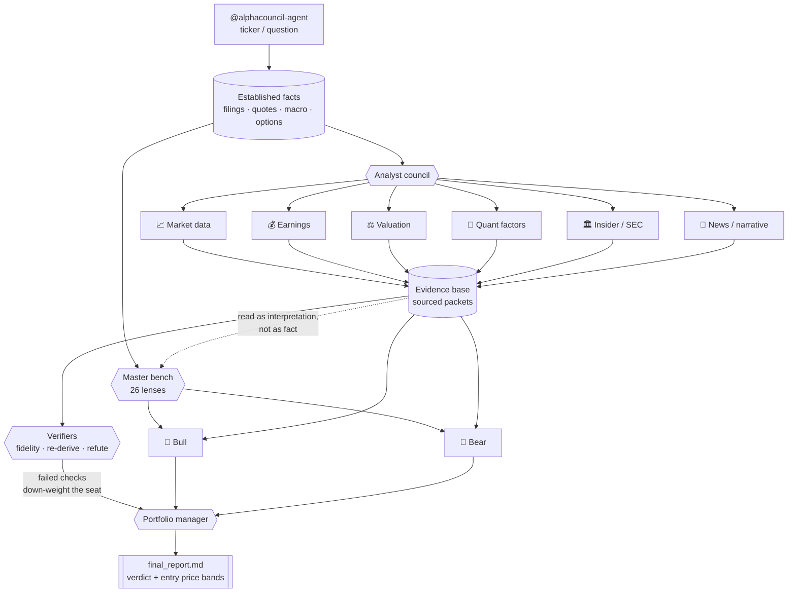

<a name="readme-top"></a>

<div align="center">


<p>
  
</p>

**English** · [中文](README.zh-CN.md) · [日本語](README.ja.md)

<p>
  
  
  
  
</p>
<p>
  
  
  
  
</p>
<p>
  
  
  
</p>

<p>
  <a href="docs/INSTALL.md"><b>Install</b></a> ·
  <a href="#-usage"><b>Usage</b></a> ·
  <a href="#-tools--27-all-keyless"><b>Tools</b></a> ·
  <a href="#-the-bench--26-investor-method-lenses"><b>The bench</b></a> ·
  <a href="#-architecture"><b>Architecture</b></a> ·
  <a href="CHANGELOG.md"><b>Changelog</b></a> ·
  <a href="#-disclaimer"><b>Disclaimer</b></a>
</p>

</div>

---

<div align="center">


<sub><i>A real run. Six lenses, none constructive — and the disagreement is in the reasons, not the call.</i></sub>

</div>

AlphaCouncil Agent is a Codex and Claude Code plugin for full public-equity research workflows. It coordinates multiple analyst agents, gathers sourced evidence, runs bull/bear debate, and produces a portfolio-manager style final report.

### ✨ Why AlphaCouncil

| | |
|---|---|
| 🏛️ **A council, not one opinion** | Eight specialist analysts by default, eleven available — market data, earnings, forward expectations, quant, valuation, news and supply chain, insider/SEC, IB events, macro, narrative, crowding. |
| 🎭 **26 selectable investor lenses** | Buffett, Munger, Graham, Lynch, Marks, Damodaran, Ackman, Cathie Wood, Pabrai and more read the **same facts** through different stated research priorities. Every council run shows the complete catalog and actual maturity before research and lets you select any `1..N` combination or `all`. |
| 🐂🐻 **Adversarial by design** | A structured bull vs bear debate, refereed by a portfolio manager who issues an actual rating. The deep visible workflow also runs three verifiers that re-source, re-derive and attack load-bearing claims; headless status explicitly reports when that fan-out did not run. |
| 🔍 **Auditable, never hallucinated** | Every claim maps to a source ID. A screen rule with missing inputs is `skipped`, never a pass. An undated headline is excluded, not shown as recent. Gaps are a section, not an omission. |
| 💰 **Entry price bands, not one number** | Three conditional bands with what each depends on. "The cycle position is undetermined" changes what the bands are conditional on; it does not excuse leaving them out. |
| 🔑 **27 tools, zero API keys, zero dependencies** | SEC EDGAR, CBOE options, Yahoo/Stooq quotes, 21 macro series, news and social — all keyless. `node mcp/server.mjs` and nothing else. |
| 🖥️ **One council on four hosts** | Claude Code, Codex, OpenCode and Grok Build run the **same** workflow, the same bench and the same gates. |

This repository is the uploadable source copy. Runtime outputs are written outside the repo under `~/.alphacouncil-agent/runs/<run_id>/`.

## Current 0.9.0 prerelease status: solo-test

The package and plugin surfaces are version `0.9.0-solo-test.2`, but this is an explicitly isolated
**solo-test** build, not formal production GA. It packages 26 physical PersonaPack v3 packs
and 52 executable `provisional_derived_proxy` tools so the deterministic path can be tested
end to end. All 26 seats remain provisional `operator_lens`; operational: **0**;
`method_model`: **0**. Human source approvals: **0**; human formula approvals: **0**;
human approval signatures: **0**.

The production loader rejects this tree, and production assembly/cutover/GA stays
fail-closed. See [docs/solo-test-0.9.0.md](docs/solo-test-0.9.0.md) for the exact commands and
verified status.

## 📜 Disclaimer

This software is for **educational and research purposes only**. It is **not
investment advice**, not a recommendation to buy or sell any security, and not a
solicitation. AI-generated analysis can be incomplete, outdated, or wrong. Do
your own research and consult a licensed financial professional before making any
investment decision. The authors accept no liability for any loss.

## Install

See **[docs/INSTALL.md](docs/INSTALL.md)** for full Codex and Claude Code setup. **Windows users:** see the [Windows section](docs/INSTALL.md#windows).

**Prerequisites:** Node.js >= 18. The headless research path also needs an
installed, authenticated **Codex CLI** (each analyst worker runs as `codex
exec`). On Windows, v0.3.0+ launches the CLI through `cmd.exe` and feeds prompts
over stdin so native `codex.cmd` installs work without WSL in the normal case.

```text
# Codex
codex plugin marketplace add Zhao73/alphacouncil-agent
# then run `codex`, open /plugins, install, and /reload-plugins

# Claude Code
/plugin marketplace add Zhao73/alphacouncil-agent
/plugin install alphacouncil-agent@alphacouncil
/reload-plugins
```

## 🚀 Usage

Just talk to it. Mention the agent and a ticker or a question:

```text
@alphacouncil-agent analyze AAPL as a long/short pitch
@alphacouncil-agent is AAPL a buy at current levels?
@alphacouncil-agent compare TSLA vs RIVN for a 12-month horizon
@alphacouncil-agent 帮我看看 700.HK 现在能不能买
@alphacouncil-agent トヨタ(7203)を分析して
```

You get back a single, chat-readable report:

```text
VERDICT: Overweight  (confidence: medium)
├─ Analyst work log ........ 11 evidence agents, 38 sourced claims
├─ Bull thesis ............. demand inflection, margin expansion, buyback
├─ Bear thesis ............. valuation, customer concentration, cycle risk
├─ Short / medium / long ... 1-4wk · 3-6mo · 12mo views
├─ Catalysts & risks ....... earnings, guidance, regulatory
├─ Data gaps ............... explicitly listed, never hidden
└─ Source table ............ every claim mapped to <task>:<source_id>
```

The concise handoff is written to `~/.alphacouncil-agent/runs/<run_id>/user_response.md`.
The full report is written to `~/.alphacouncil-agent/runs/<run_id>/final_report.md`,
with analyst Markdown files and `artifact_index.md` in the same run directory.

### Slash commands

**One command, `/alpha`.** Modes are arguments, so there is one name to remember
rather than four in a menu of a hundred.

| Invocation | What runs | Model spend |
|---|---|---|
| `/alpha <ticker>` | Shows every master, confirms `1..N`/ranges/`all`, then runs the full council | one subagent per selected seat |
| `/alpha <ticker> quick` | Same mandatory master selection, then 4 analysts + selected masters + debate; no verification | varies with selection |
| `/alpha <ticker> screen` | Mechanical filings screen only | **none** |
| `/alpha <ticker> options` | IV term structure, skew, positioning | **none** |
| `/alpha <ticker> news` | Dated filings and headlines | **none** |
| `/alpha market <theme>` | What the market is talking about | **none** |
| `/alpha` | Lists the modes and stops | **none** |

The four marked **none** call keyless data tools and spawn no subagents, so they cost
nothing beyond the turn you type them in. Full and quick first display every master with a
number, identity, method and best-use case. A native multi-select may make that easier, but
all four hosts support the same numbered text fallback. Even a request that already names a
master must show the catalog and confirm a fresh one-run receipt before research starts.

Any listed equity: `/alpha AAPL` · `/alpha 0700.HK quick` · `/alpha 7203.T news` · `/alpha market rates`.
Filings-based modes need a US filer; other markets are reported through `market_coverage` rather than silently returning nothing.


Available in Claude Code, OpenCode and Grok Build as soon as the plugin is installed. Codex keeps
its prompts user-scoped, so copy it once: `mkdir -p ~/.codex/prompts && cp commands/alpha.md ~/.codex/prompts/`

## What It Does

Default stock-analysis runs are full runs, not lite summaries:

- Market data and price action
- Earnings deep dive, including the earnings call
- Forward expectations, implied beat/miss thresholds, and sell-side target revisions
- Quant factor view: momentum, trend, volatility, liquidity, relative strength, crowding
- Valuation and long/short pitch, with price bands rather than a single target
- News, industry context, supply chain, and management's words checked against their actions
- SEC filings, Form 4 insider transactions, buybacks, dilution, debt and capital allocation
- Investment-banking event analysis for M&A, ECM, debt, buybacks and strategic transactions
- A selectable bench of 26 investor method lenses reading the same facts
- Bull researcher, bear researcher and portfolio-manager synthesis

The final report is readable directly in chat. It carries analyst work logs, data and filing
summaries, the bull/bear debate, the PM verdict, entry price bands, short/medium/long-term
views, data gaps, confidence and a source table.

## 🔧 Tools — 27, all keyless

Nothing below needs an API key, an account, or a config file. Install and run.

| Area | Tools | Source |
|---|---|---|
| **Filings** | `screen_ticker` `screen_candidates` `list_us_universe` `compose_research_brief` | SEC EDGAR XBRL |
| **Non-US filings** | `market_financials` `market_coverage` | TWSE keyless; DART/EDINET on a free key; HK/CN documents only |
| **Market data** | `get_quote` `get_macro_snapshot` | Yahoo / Stooq, 21 macro series + 5 derived |
| **Options** | `get_options_chain` | CBOE delayed quotes — IV term structure, 25-delta skew, open interest, Greeks |
| **News** | `get_news` `get_market_narrative` | Yahoo, Google News, SEC Atom, Fed, WSJ, CNBC |
| **Social** | `get_social_pulse` `verify_x_post` | Reddit, Hacker News, Bluesky |
| **Industry** | `industry_brief` `industry_peers` `industry_coverage` `list_industries` | SIC across all US filers + curated maps |
| **Workflow** | `analyze_symbol` `plan_visible_run` `collect_evidence` `read_run` and 5 more | — |

**What it deliberately will not do.** Every one of these is stated in the tool output itself,
not only in the docs, because the payload is what gets quoted downstream:

- **IV percentile is not computable.** The chain is a snapshot with no history, so any claim
  that volatility is high or low against its own past is reported as an open question.
- **X / Twitter has no free discovery channel** as of 2026-07. Nitter search is dead, the X
  API bills per post and xAI bills per call. Professional FinTwit is **not** covered, and
  Reddit is not a substitute for it.
- **A screen rule whose inputs are missing is `skipped`, never a pass.**
- **A news item with no parsable timestamp is excluded**, not shown as recent.
- **A contract reporting `iv = 0`** — CBOE does this for expired and deep-in-the-money
  contracts — is dropped rather than averaged in, because a zero does not look like a gap,
  it looks like a calm stock.

## 🏛️ The bench — 26 investor method lenses

Reconstructions of publicly documented methods, not anything the named people said. Each
states how it thinks, what it notices first, its characteristic challenge, and **its own
failure mode** — a seat that cannot name how it goes wrong will not flag it when it does.

| Roster | Lenses |
|---|---|
| Value | Buffett · Munger · Duan Yongping · Li Lu |
| Classic value | Graham · Fisher · Lynch · Marks · Klarman |
| Adversarial | Soros · Druckenmiller · Dalio · Burry · short seller |
| Quant | Simons · Asness · Thorp |
| Options | Taleb · Natenberg · Sinclair |
| Modern | Aschenbrenner |
| v3 expansion | Damodaran · Ackman · Cathie Wood · Pabrai · Jhunjhunwala |

The 0.9.0 solo-test catalog has 26 selectable physical v3 packs, but **26 physical packs is
not 26 approved method models**. Every seat is a provisional `operator_lens` backed by
project-derived proxy material; the 52 tools are executable test proxies, not human-approved
formula attribution. Operational and `method_model` counts are both zero, and production GA
remains fail-closed.

Masters read the **same established facts** the analysts read — filings, quotes, financials,
macro — and receive the analyst packets separately, labelled as other seats' readings rather
than as fact. That separation is the point: the bench is worth having only because Munger
looks at incentives where an analyst looked at margins. See [docs/attribution.md](docs/attribution.md).

## 🧩 Architecture


```mermaid
flowchart TD
    U["@alphacouncil-agent<br/>ticker / question"] --> G[("Established facts<br/>filings · quotes · macro · options")]
    G --> AG{{"Analyst council"}}
    G --> MS{{"Master bench<br/>26 lenses"}}
    AG --> A1["📈 Market data"]
    AG --> A2["💰 Earnings"]
    AG --> A3["⚖️ Valuation"]
    AG --> A4["🧮 Quant factors"]
    AG --> A5["🏛️ Insider / SEC"]
    AG --> A6["📰 News / narrative"]
    A1 --> EV[("Evidence base<br/>sourced packets")]
    A2 --> EV
    A3 --> EV
    A4 --> EV
    A5 --> EV
    A6 --> EV
    EV -.->|"read as interpretation,<br/>not as fact"| MS
    EV --> VF{{"Verifiers<br/>fidelity · re-derive · refute"}}
    VF -->|"failed checks<br/>down-weight the seat"| PM
    MS --> BULL["🐂 Bull"]
    MS --> BEAR["🐻 Bear"]
    EV --> BULL
    EV --> BEAR
    BULL --> PM{{"Portfolio manager"}}
    BEAR --> PM
    PM --> R[["final_report.md<br/>verdict + entry price bands"]]
```

The masters branch off the facts, not off the packets. Feeding 26 lenses one analyst's
selection of what mattered would give them all the same blind spot — a large and perfectly
correlated error — and would remove the reason for having a bench at all.

Key files:

- `.codex-plugin/plugin.json` - Codex plugin metadata.
- `codex.mcp.json` - isolated Codex MCP server wiring.
- `assets/logo-icon.png` - plugin icon used by Codex.
- `skills/alphacouncil-agent/SKILL.md` - runtime instructions for Codex.
- `mcp/server.mjs` - JSON-RPC MCP server and workflow implementation.
- `scripts/selfcheck.mjs` - minimal regression check.

## 🆚 Codex vs Claude Code edition

Both editions share the same workflow, JSON packet contract, audit artifacts, the no-API-keys / live-web evidence model, and the same disclaimer. The Claude Code edition changes only *how* the council is run.

| | Codex edition | Claude Code edition |
|---|---|---|
| Council execution | `codex exec` workers, concurrency-capped | All 11 analysts as parallel `Task` subagents, one fan-out |
| Per-analyst context | Separate process | Separate subagent, full isolated context window |
| Evidence | `codex exec --search` | `WebSearch` + `WebFetch` in each analyst's own context |
| Evidence → debate | Sequential | Hard barrier on the run's phase machine |
| Debate depth | 3 rounds (case / rebuttal / Q&A), server-run | 3 rounds, bull + bear in parallel per round |
| Claim verification | Missing-source gate (run flagged, report banner) | + per-claim adversarial verify: re-fetch cited URL, re-derive, refute *(host-driven)* |
| Full-run enforcement | Incomplete runs marked `incomplete` (server gate) | Same gate, plus a hard barrier before debate |
| Model & cost | One model | **Pick per role** — evidence on Sonnet, debate/verdict on Opus 4.8 (or all-Opus / all-Sonnet) |
| Language | User's language | User's language across every subagent + the live workflow |

**Honest scope:** same model family, same prompts, same audit contract — the win is context isolation, always-on parallel fan-out, and deterministic gates, *not* a smarter model. As of **v0.3.0** the shared server runs the 3-round debate, enforces missing-source / full-run / report-quality gates, writes concise and full report artifacts, and supports native Windows Codex CLI launching. As of **v0.3.1**, the plugin also bundles `agent-skills-governance`, an `addyosmani/agent-skills`-style anti-laziness skill with explicit stop gates and exit criteria. The Claude Code edition adds parallel per-round execution and host-driven per-claim verification. Live-web staleness and paywalls limit both editions equally.

## Data Contract

Evidence agents return JSON packets:

```json
{
  "task": "market_data",
  "symbol": "AAPL",
  "as_of": "YYYY-MM-DD",
  "summary": "string",
  "claims": [
    {
      "claim": "string",
      "evidence": "string",
      "confidence": "high|medium|low",
      "source_ids": ["market_data:S1"]
    }
  ],
  "metrics": {},
  "sources": [
    {
      "id": "market_data:S1",
      "title": "string",
      "url": "https://example.com",
      "published_at": "YYYY-MM-DD or unknown",
      "retrieved_at": "YYYY-MM-DD"
    }
  ],
  "open_questions": ["missing data item"],
  "confidence": "high|medium|low"
}
```

All source IDs are task-scoped as `<task>:<source_id>`. Missing data must be reported in `open_questions` and in the final report's data-gap section.

## Run Locally

```bash
npm run check
```

The check validates:

- MCP server syntax
- tool schema exposure
- source ID scoping
- default real-run behavior
- visible-run recording
- `events.jsonl`, `status.json`, `all_agents.md`, `source_manifest.json`
- `final_report.md`, `user_response.md`, `artifact_index.md`, `report_quality.json`
- one Markdown file per evidence analyst plus bull, bear, and portfolio manager
- final report includes analyst work log, bull/bear debate record and data gaps

## Codex Install Shape

The plugin expects this local layout:

```text
.codex-plugin/plugin.json
codex.mcp.json
skills/alphacouncil-agent/SKILL.md
mcp/server.mjs
scripts/selfcheck.mjs
package.json
```

`codex.mcp.json` runs:

```json
{
  "mcpServers": {
    "alphacouncil-agent": {
      "command": "node",
      "args": ["./mcp/server.mjs"],
      "cwd": "."
    }
  }
}
```

## Notes

This is an independent Codex plugin implementation. It uses a multi-agent investment-committee workflow: analyst teams, evidence sharing, bull/bear debate and portfolio-manager synthesis.

No API keys, brokerage credentials, private filings or generated run artifacts should be committed.

## ⭐ Star History

<div align="center">

<a href="https://star-history.com/#Zhao73/alphacouncil-agent&Date">
  
</a>

<br/><br/>

<picture>
  <source media="(prefers-color-scheme: dark)" srcset="assets/logo-dark.png" />
  
</picture>

If AlphaCouncil saved you time, consider leaving a ⭐ — it genuinely helps.

<a href="#readme-top">↑ Back to top</a>

</div>
