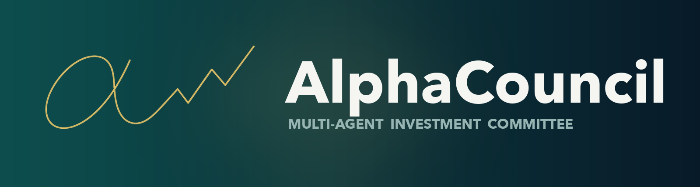
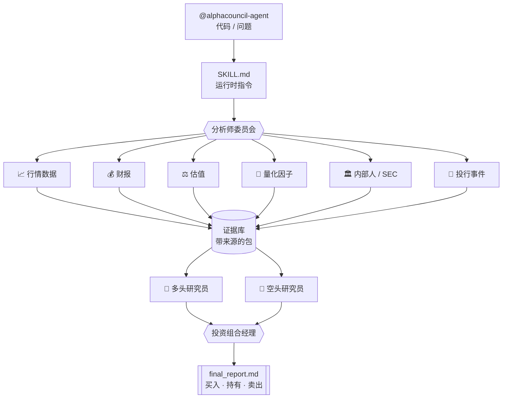

<a name="readme-top"></a>

<div align="center">



### 装进终端里的多智能体投资委员会

召集一组分析师代理 → 收集带来源的证据 → 多空辩论 → 投资组合经理拍板:**买入 · 增持 · 持有 · 减持 · 卖出**

[English](README.md) · **中文** · [日本語](README.ja.md)

<p>
  
  
  
  
</p>
<p>
  
  
  
</p>

<p>
  <a href="#-用法"><b>用法</b></a> ·
  <a href="docs/INSTALL.md"><b>安装</b></a> ·
  <a href="#-架构"><b>架构</b></a> ·
  <a href="#-免责声明"><b>免责声明</b></a>
</p>

</div>

---

<div align="center">


<sub><i>一句命令 → 一组分析师代理 → 多空辩论 → 投资组合经理给出结论。</i></sub>

</div>

AlphaCouncil Agent 是一个面向**上市股票研究**的 Codex / Claude Code 插件。它会协调多个分析师子代理、收集带来源的证据、进行多空辩论,并产出投资组合经理风格的最终报告。

### ✨ 为什么用 AlphaCouncil

| | |
|---|---|
| 🏛️ **是委员会,不是一家之言** | 11 个专项分析师代理(行情、财报、估值、量化、内部人/SEC、投行事件……)并行工作。 |
| 🐂🐻 **天生对抗式** | 结构化的多头 vs 空头辩论,由投资组合经理代理裁决并给出实际评级。 |
| 🔍 **可审计,不瞎编** | 每条结论都映射到 source ID;缺失数据写进「数据缺口」章节,绝不隐藏。 |
| ⏱️ **多周期结论** | 买入/持有/卖出,外加独立的 1-4 周、3-6 月、12 月判断。 |
| 🔑 **不依赖金融 API,无需任何密钥** | 不需要金融数据 API、行情源或券商账号。分析师通过代理自带的联网搜索实时取证(**Codex 网页搜索** / **Claude Code 的 WebSearch + WebFetch**),只消耗你已有的 Codex / Claude Code 订阅额度。MIT 开源。 |

本仓库是可上传的源代码副本。运行产物写在仓库之外的 `~/.alphacouncil-agent/runs/<run_id>/` 下。

## 📜 免责声明

本软件**仅供教育与研究**,**不构成投资建议**,不构成任何证券买卖推荐或要约。AI 生成的分析可能不完整、过时或错误。投资决策前请自行核实并咨询持牌专业人士。作者不对任何损失承担责任。

## 安装

完整的 Codex 与 Claude Code 安装说明见 **[docs/INSTALL.md](docs/INSTALL.md)**。

**前置条件:** Node.js ≥ 18。headless 真跑研究还需要**已安装并登录的 Codex CLI**(每个分析师 worker 都以 `codex exec` 运行);没有 codex 时,改用安装文档里的 visible 工作流。

```text
# Codex
codex plugin marketplace add Zhao73/alphacouncil-agent
# 再 codex → /plugins 安装 → /reload-plugins

# Claude Code
/plugin marketplace add Zhao73/alphacouncil-agent
/plugin install alphacouncil-agent@alphacouncil
/reload-plugins
```

## 🚀 用法

直接对它说话,@ 一下代理,带上代码或问题:

```text
@alphacouncil-agent 把 NVDA 当成多空 pitch 来分析
@alphacouncil-agent 现在这个价位 AAPL 能不能买?
@alphacouncil-agent 以 12 个月维度对比 TSLA 和 RIVN
@alphacouncil-agent 帮我看看 700.HK 现在能不能买
@alphacouncil-agent トヨタ(7203)を分析して
```

返回的是一份可直接在聊天里读完的报告:

```text
结论:增持  (置信度:中)
├─ 分析师工作记录 ...... 11 个证据代理,38 条带来源主张
├─ 多头论点 ............ 需求拐点、利润率扩张、回购
├─ 空头论点 ............ 估值、客户集中度、周期风险
├─ 短 / 中 / 长期 ...... 1-4周 · 3-6月 · 12月 判断
├─ 催化剂与风险 ........ 财报、指引、监管
├─ 数据缺口 ............ 明确列出,从不隐藏
└─ 来源表 .............. 每条主张映射到 <task>:<source_id>
```

完整报告同时写入 `~/.alphacouncil-agent/runs/<run_id>/final_report.md`。

## 它能做什么

默认的个股分析是**完整流程**,不是精简摘要:

- 行情与价格走势
- 财报深挖
- 前瞻预期与隐含的 beat/miss 门槛
- 卖方评级与目标价修正
- 电话会管理层信号
- 量化因子视角:动能、趋势、波动率、成交量/流动性、相对强弱、short interest、borrow、期权 IV/skew/隐含波动(能取到时)
- 估值与多空 pitch
- 新闻、行业背景、CEO/管理层与公开行业人物发言
- SEC 文件、Form 4 内部人交易、回购、稀释、债务与资本配置
- 针对并购/增发/债务/回购或战略交易的投行事件分析
- 多头研究员、空头研究员与投资组合经理综合

最终报告要求能直接在聊天里读完,包含分析师工作记录、数据/新闻/文件摘要、多空辩论、PM 结论、短/中/长期判断、数据缺口、置信度与来源表。

## 🧩 架构



关键文件:

- `.codex-plugin/plugin.json` —— Codex 插件元数据
- `.claude-plugin/plugin.json` —— Claude Code 插件清单
- `.mcp.json` —— MCP server 接线
- `skills/alphacouncil-agent/SKILL.md` —— 运行时指令
- `mcp/server.mjs` —— JSON-RPC MCP server 与工作流实现
- `scripts/selfcheck.mjs` —— 最小回归自检

## 🆚 Codex 版 vs Claude Code 版

两个版本共享同一套工作流、JSON 包契约、审计产物、无需 API key 的联网取证模式和同样的免责声明。Claude Code 版只改变「**怎么跑**」这个委员会。

| | Codex 版 | Claude Code 版 |
|---|---|---|
| 委员会执行 | `codex exec` worker,有并发上限 | 11 个分析师作为并行 `Task` 子代理,一次性展开 |
| 每个分析师上下文 | 独立进程 | 独立子代理,各自完整独立上下文窗口 |
| 取证 | `codex exec --search` | 每个分析师在自己上下文里用 `WebSearch` + `WebFetch` |
| 证据 → 辩论 | 串行 | 基于运行相位机的硬性 barrier 门控 |
| 辩论深度 | 单轮 bull → bear → PM | 3 轮(立论/反驳/问答),每轮多空并行 *(本版设计)* |
| claim 验证 | 仅标记缺失 source,不处理 | 逐条对抗式验证:重抓引用 URL + 独立复核 + 反驳 *(本版设计)* |
| 模型与成本 | 单一模型 | **按角色选** —— 取证用 Sonnet,辩论/裁决用 Opus 4.8(也可全 Opus / 全 Sonnet) |
| 语言 | 用户语言 | 每个子代理 + 实时 workflow 全程用户语言 |

**诚实边界:** 同模型家族、同提示词、同审计契约 —— 优势在于上下文隔离、始终并行展开、确定性 barrier、强制引用验证,**不是**更聪明的模型。3 轮辩论和验证阶段是 Claude Code 版的设计;当前共享代码还是单轮。联网数据的时效性与付费墙对两版限制相同。

## 数据契约

证据子代理返回 JSON 包:

```json
{
  "task": "market_data",
  "symbol": "NVDA",
  "as_of": "YYYY-MM-DD",
  "summary": "string",
  "claims": [
    { "claim": "string", "evidence": "string", "confidence": "high|medium|low", "source_ids": ["market_data:S1"] }
  ],
  "metrics": {},
  "sources": [
    { "id": "market_data:S1", "title": "string", "url": "https://example.com", "published_at": "YYYY-MM-DD or unknown", "retrieved_at": "YYYY-MM-DD" }
  ],
  "open_questions": ["missing data item"],
  "confidence": "high|medium|low"
}
```

所有 source ID 都按 `<task>:<source_id>` 全局作用域。缺失数据必须写进 `open_questions`,并体现在最终报告的数据缺口章节。

## 本地运行

```bash
npm run check
```

自检会校验:MCP server 语法、工具 schema 暴露、source ID 作用域、默认真跑行为、可见运行录入、`events.jsonl`/`status.json`/`all_agents.md`/`source_manifest.json`,以及最终报告是否包含分析师工作记录、多空辩论记录和数据缺口。

## 说明

这是一个独立的插件实现,采用多代理投资委员会工作流:分析师团队、证据共享、多空辩论、投资组合经理综合。

请勿提交任何 API key、券商凭证、非公开文件或生成的运行产物。

## ⭐ Star 趋势

<div align="center">

<a href="https://star-history.com/#Zhao73/alphacouncil-agent&Date">
  
</a>

<br/><br/>

<picture>
  <source media="(prefers-color-scheme: dark)" srcset="assets/logo-dark.png" />
  
</picture>

如果 AlphaCouncil 帮你省了时间,点个 ⭐ 是最大的支持。

<a href="#readme-top">↑ 回到顶部</a>

</div>
