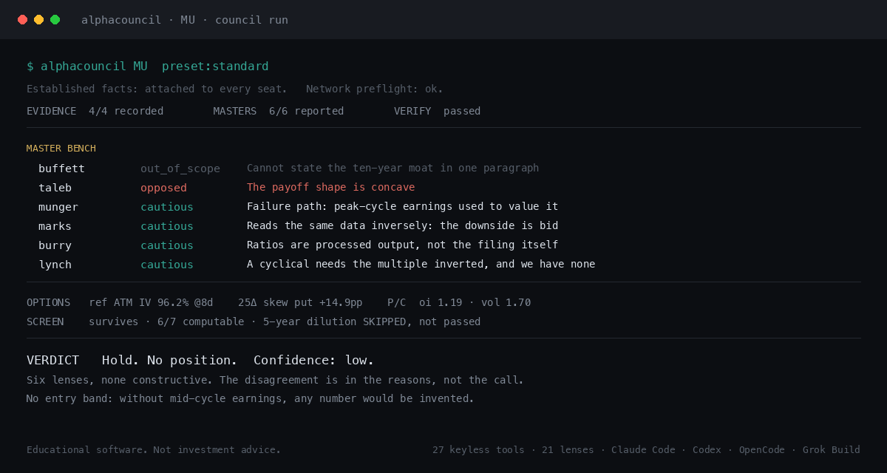
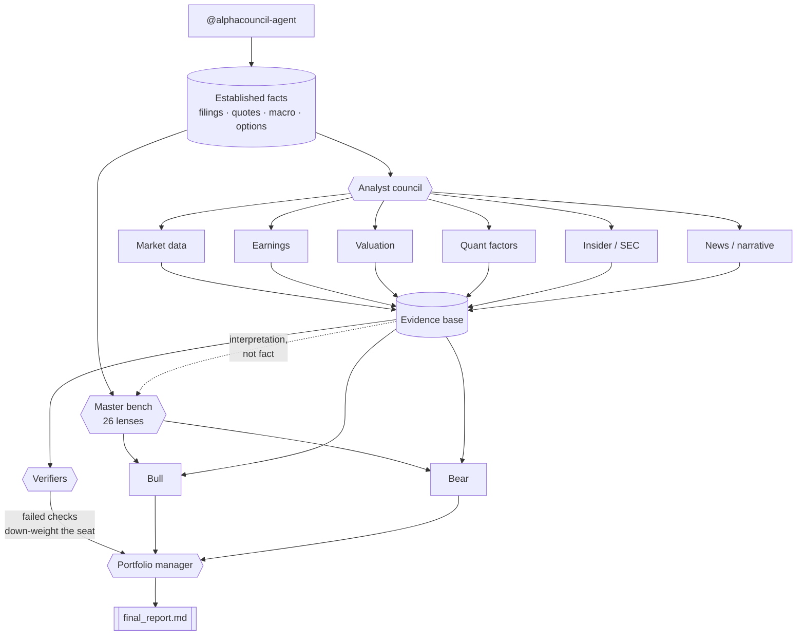

<a name="readme-top"></a>

<div align="center">


### 装进终端里的多智能体投资委员会

召集一组分析师代理 → 收集带来源的证据 → 多空辩论 → 投资组合经理拍板:**买入 · 增持 · 持有 · 减持 · 卖出**

[English](README.md) · **中文** · [日本語](README.ja.md)

<p>
  
  
  
  
</p>
<p>
  
  
  
</p>

<p>
  <a href="#-用法"><b>用法</b></a> ·
  <a href="docs/INSTALL.md"><b>安装</b></a> ·
  <a href="#-架构"><b>架构</b></a> ·
  <a href="#-免责声明"><b>免责声明</b></a>
</p>

</div>

---

<div align="center">



<sub><i>一次真实运行。六位大师无一支持买入 —— 而分歧不在结论，在理由。</i></sub>

</div>

AlphaCouncil Agent 是一个面向**上市股票研究**的 Codex / Claude Code 插件。完整议会是默认模式；只有用户明确要求 `quick` 时，才进入更小的插件托管 headless 合同。两种模式都会收集带来源的证据、运行所选方法席，并产出可审计的 PM 报告。

### ✨ 为什么用 AlphaCouncil

| | |
|---|---|
| 🏛️ **是委员会,不是一家之言** | 完整模式默认 8 个证据席、最多 11 个；quick 固定 4 个并行证据席。两者都在研究前完整展示 26 个方法席。 |
| 🐂🐻 **天生对抗式** | 完整模式跑三轮多空交叉质询；quick 只跑一轮并行 Bull/Bear 陈述和短 PM，且明确不声称完成对抗 verifier。 |
| ⏱️ **完整 headless 有硬时限** | 插件托管 full 将 8 个分析师同波启动、每轮 Bull/Bear 同时启动，并在 30 分钟内保存终态；外部服务故障会明确 `incomplete`，不会静默漏席。 |
| 🔍 **可审计,不瞎编** | 每条结论都映射到 source ID;缺失数据写进「数据缺口」章节,绝不隐藏。 |
| ⏱️ **多周期结论** | 买入/持有/卖出,外加独立的 1-4 周、3-6 月、12 月判断。 |
| 🔑 **不依赖金融 API,无需任何密钥** | 不需要金融数据 API、行情源或券商账号。分析师通过代理自带的联网搜索实时取证(**Codex 网页搜索** / **Claude Code 的 WebSearch + WebFetch**),只消耗你已有的 Codex / Claude Code 订阅额度。MIT 开源。 |
| 📚 **内置研究方法论** | 股票研究与投行事件分析的方法论以**本地 skill** 形式打包(`skills/public-equity-investing`、`skills/investment-banking`)——不依赖 Codex 专属远程工作流,Claude Code 也能获得同等研究深度。 |
| 📈 **真实行情兜底,免 key** | 内置 `get_quote` 通过 Yahoo + Stooq 拉延迟(~15分钟)的指数 / 股指期货(含夜盘)/ 汇率 / 利率 / 波动率 / 商品 / 个股点位——不用 API key,分析师引用真实数字而非猜测。 |
| 🧭 **公司、ETF 与指数正确分流** | 先识别资产再研究：公司走发行人财务，ETF 走带时点持仓穿透，指数走聚合方法；QQQ/SPY 不会再被当成有自身营收和 EPS 的公司。 |

本仓库是可上传的源代码副本。运行产物写在仓库之外的 `~/.alphacouncil-agent/runs/<run_id>/` 下。

## 当前 0.9.5 预览状态：non-GA solo-test

`0.9.5` 是 GitHub preview；本次源码升级不执行 npm publish，也不改变 npm
dist-tag。不要在未独立核验时声称 `@next` 已包含 0.9.5。它是有界议会运行时预览，
**不是**正式生产 GA。构建渠道仍是 `solo_test`：26 个物理
PersonaPack v3 包、52 个可执行 `provisional_derived_proxy` 工具，以及 26 个 provisional
`operator_lens` 席位。`operational`：**0**；已验证 `method_model`：**0**；人工来源/公式
审批与审批签名仍为 **0**。

本次只升级运行时与报告协议，保留未改动的 `persona_pack_version=0.9.4`，因此 26 个 pack
hash 与既有仿真证据不会仅因插件代码升到 0.9.5 而漂移。

生产 loader 仍拒绝这套树，production assembly、cutover 与 GA 继续 fail-closed。精确的
ETF/指数与 full/quick 边界见 [v0.9.5 发布合同](docs/releases/v0.9.5.md)，`quick_v1` 与 `full_v2` 的报告差异见
[报告合同](docs/report-contract.md)。

## 📜 免责声明

本软件**仅供教育与研究**,**不构成投资建议**,不构成任何证券买卖推荐或要约。AI 生成的分析可能不完整、过时或错误。投资决策前请自行核实并咨询持牌专业人士。作者不对任何损失承担责任。

## 安装

完整的 Codex 与 Claude Code 安装说明见 **[docs/INSTALL.md](docs/INSTALL.md)**。**Windows 用户**见 [Windows 小节](docs/INSTALL.md#windows)。

**前置条件:** Node.js ≥ 18。headless 真跑研究还需要**已安装并登录的 Codex CLI**(每个分析师 worker 都以 `codex exec` 运行);没有 codex 时,改用安装文档里的 visible 工作流。

```text
# Codex
codex plugin marketplace add Zhao73/alphacouncil-agent
# 再 codex → /plugins 安装 → /reload-plugins

# Claude Code
/plugin marketplace add Zhao73/alphacouncil-agent
/plugin install alphacouncil-agent@alphacouncil
/reload-plugins
```

## 🚀 用法

直接对它说话,@ 一下代理,带上代码或问题:

```text
@alphacouncil-agent 把 0700.HK 当成多空 pitch 来分析
@alphacouncil-agent 现在这个价位 AAPL 能不能买?
@alphacouncil-agent 以 12 个月维度对比 TSLA 和 RIVN
@alphacouncil-agent 帮我看看 700.HK 现在能不能买
@alphacouncil-agent トヨタ(7203)を分析して
```

返回的是一份可直接在聊天里读完的报告:

```text
结论:增持  (置信度:中)
├─ 分析师工作记录 ...... 11 个证据代理,38 条带来源主张
├─ 多头论点 ............ 需求拐点、利润率扩张、回购
├─ 空头论点 ............ 估值、客户集中度、周期风险
├─ 短 / 中 / 长期 ...... 1-4周 · 3-6月 · 12月 判断
├─ 催化剂与风险 ........ 财报、指引、监管
├─ 数据缺口 ............ 明确列出,从不隐藏
└─ 来源表 .............. 每条主张映射到 <task>:<source_id>
```

简洁交付摘要写入 `~/.alphacouncil-agent/runs/<run_id>/user_response.md`。
完整报告写入 `~/.alphacouncil-agent/runs/<run_id>/final_report.md`。
同一目录还会写入每个分析师的 Markdown 文件和 `artifact_index.md` 文件索引。完整模式的摘要
会显示系统价格（或明确的行情缺口）、8 个分析师的状态/摘要，以及每个所选方法席冻结的立场
和可读解释/状态。摘要最后一节给出准确的所选席位数，并逐席输出一个陈词；选择 `all` 时
结尾就是完整 26 席。它们是项目派生的临时方法席输出，不是本人引语。

### 斜杠命令

**一个命令，`/alpha`。** 模式当参数 —— 只用记一个名字，而不是在上百条命令的菜单里找四个。

| 输入 | 跑什么 | 额度消耗 |
|---|---|---|
| `/alpha <ticker>` | 逐人展示全部大师，确认后运行 full；插件托管 headless ≤30 分钟 | 每个所选 v3 席为确定性立场 + 一个独立 voice worker |
| `/alpha <ticker> quick` | 展示全部 26 席，确认 1-4 席（禁用 `all`），再跑插件托管 `quick_v1`（≤10 分钟） | 随选择数量变化 |
| `/alpha <ticker> screen` | 只跑机械筛选 | **零** |
| `/alpha <ticker> options` | 隐含波动率期限结构、偏斜、持仓分布 | **零** |
| `/alpha <ticker> news` | 带日期的申报与新闻 | **零** |
| `/alpha market <theme>` | 市场在讲什么故事 | **零** |
| `/alpha` | 列出模式后停下 | **零** |

标「零」的四个只调免 key 数据工具、**不启动任何子代理**，除了你敲的这一轮之外不消耗额度。完整与 quick 都是议会模式：研究前逐人显示编号、身份、方法和最适用场景。完整模式可选 `all`；quick 只能选择 1-4 个不同席位并拒绝 `all`。四个宿主都支持统一的编号文本选择，原生多选只是增强。即使请求已经点名，也只作为预填；仍须显示全表并确认本次一次性、与模式绑定的 receipt。

任何上市股票：`/alpha AAPL` · `/alpha 0700.HK quick` · `/alpha 7203.T news` · `/alpha market rates`。
基于申报的模式需要美国申报主体；其他市场会通过 `market_coverage` 说明覆盖情况，而不是静默返回空结果。

### Full v2 —— 插件托管 30 分钟硬上限

插件托管 headless `analyze_symbol(council_mode="full")` 从持久化 queued 状态到终态工件落盘，
全局硬上限为 **1800000 ms**。8 个必需证据席同波并行。证据门禁通过后，每个所选物理 v3
方法先运行确定性政策并冻结立场，再启动一个只属于该 stable ID 的独立 voice worker；它可以
解释立场，但不能改立场或补造 typed fact。三轮中每轮 Bull/Bear 同时启动，二者都完成后才
进入下一轮，最后才运行 PM。

时限到达时，系统以 `incomplete` 保存终态，并逐项列出超时、失败和跳过的席位。30 分钟保证
的是“必有可审计终态”，不是搜索、模型传输或数据源恶化时仍保证全席成功。visible-host 的
`plan_visible_run` 由外部宿主调度，插件无法强制终止其子代理，因此不享有这个硬时限。

full 的交付摘要必须列出全部所选 stable master ID、全部 8 个分析师，以及系统行情快照或
明确的不可用缺口。方法席 voice 是本次运行记录的 provisional lens 解释，**不是真人原话、
背书或当前观点**。系统文案支持中文 (`zh-CN`)、英文、日文、韩文，每个 worker 也接收本轮语言。

### Quick v1 —— 有界，但不等于完整议会

不会因为用户着急或完整运行失败就自动切换 quick。Quick 只能通过插件托管的 headless
`analyze_symbol(council_mode="quick")` 运行；`plan_visible_run` 会拒绝 quick。完整展示 26 席并
确认 1-4 席后，执行图固定为：

1. `market_data`、`earnings_deep_dive`、`valuation_long_short`、
   `news_industry_management` 四席一波并行；
2. 所选 1-4 个方法席一波并行；
3. Bull 与 Bear 各做一次陈述并行启动，二者结束后运行一个短 PM；
4. 确定性装配 `quick_v1` 报告和标准工件。

公司与行业新闻必须有日期，且落在截至 `as_of` 的最近 120 天内；未来、无日期和更旧条目不会
被展示为「最近新闻」，而会进入数据缺口。queue 到工件持久化的硬上限为 **600000 ms**：
grounding 等待 20 秒；每个并行证据 worker 210 秒；每个并行方法 worker 90 秒；Bull/Bear
各 90 秒；PM 90 秒；最终装配/持久化预留 20 秒。重试占用同一分项和总时钟。

Quick 不跑第二轮反驳、第三轮精确问答，也不跑
`source_fidelity`/`rederivation`/`refuter` 对抗 verifier。只有满足明确的最低覆盖规则并写入
system-owned degraded ledger 时，才可终止为 `degraded`；否则缺少必需工作就是 `incomplete`
或 `failed`。`report_quality=passed` 只代表 `quick_v1` 结构通过，不会把 degraded 提升为
complete，也不代表等价于 `full_v2`。方法席输出是本次运行记录的 provisional lens 结果，
**不是对应真人说过的话或引语**。


Claude Code、OpenCode、Grok Build 装完即可用。Codex 的 prompts 是用户级的，拷贝一次：
`mkdir -p ~/.codex/prompts && cp commands/alpha.md ~/.codex/prompts/`

## 它能做什么

默认是完整运行，不是精简摘要：

- 行情与价格行为
- 财报深度分析，含财报电话会
- 前瞻预期、隐含的超预期/不及预期门槛、卖方评级与目标价修正
- 量化因子：动能、趋势、波动率、流动性、相对强弱、拥挤度
- 估值与多空论点，给价格区间而非单一目标价
- 新闻、行业背景、产业链，以及管理层言行核对
- SEC 申报、Form 4 内部人交易、回购、稀释、债务与资本配置
- 并购、股权与债务融资、回购等事件分析
- 可逐席选择的 26 个投资方法视角读取同一批事实
- 多头、空头与 PM 裁决

完整模式在 mandatory evidence barrier 上 fail-fast。任何必需证据席在一次有界 parse-only
修复后仍失败，系统会保存失败与诊断工件，跳过所选方法席、多空辩论和 PM 模型调用，并以
`incomplete` 终止；不会为一个已不可能满足 `full_v2` 的运行继续消耗下游合成时间。

最终报告可直接在对话中阅读，包含分析师工作记录、数据与申报摘要、多空辩论记录、PM 裁决、入场价格区间、短中长期观点、数据缺口、置信度和来源表。

## 🔧 工具 —— 31 个，全部免 key

以下没有一项需要 API key、账号或配置文件。装完直接跑。

| 领域 | 工具 | 数据源 |
|---|---|---|
| **资产识别与申报** | `compose_research_brief` `screen_ticker` `screen_candidates` `list_us_universe` | 公司/ETF/指数分流；仅在适用时使用 SEC EDGAR XBRL |
| **非美申报** | `market_financials` `market_coverage` | 台交所免 key；DART/EDINET 需免费 key；港股/A股仅文档 |
| **行情** | `get_quote` `get_macro_snapshot` | Yahoo / Stooq，21 条宏观序列 + 5 项派生 |
| **期权** | `get_options_chain` | CBOE 延迟报价 —— 隐含波动率期限结构、25Δ 偏斜、未平仓量、Greeks |
| **新闻** | `get_news` `get_market_narrative` | Yahoo、Google News、SEC Atom、美联储、WSJ、CNBC |
| **社交** | `get_social_pulse` `verify_x_post` | Reddit、Hacker News、Bluesky |
| **行业** | `industry_brief` `industry_peers` `industry_coverage` `list_industries` | 全美股 SIC 分类 + 精选产业地图 |
| **流程** | `analyze_symbol` `plan_visible_run` `collect_evidence` `read_run` 等 9 个 | — |

**它刻意不做什么。** 以下每一条都写在工具输出本身里，不只写在文档里 —— 因为被下游引用的是 payload：

- **隐含波动率分位算不出来。** 期权链是快照无历史，任何「波动率相对自身历史偏高/偏低」的论断都报为待解问题。
- **X / Twitter 没有免费发现通道**（截至 2026-07）。Nitter 搜索已死、X API 按条计费、xAI 按次计费。**专业 FinTwit 未被覆盖，Reddit 不是它的替代品。**
- **缺输入的筛选规则报 `skipped`，绝不当作通过。**
- **无可解析时间戳的新闻条目被剔除**，不会被展示为「最新」。
- **报 `iv = 0` 的合约被丢弃** —— CBOE 对已过期和深度实值合约返回 0，而 0 混进均值不像缺失值，像一只很平静的股票。

## 🏛️ 大师议席 —— 26 位

这是对公开方法论的重构，**不是本人的任何表述**。每一位都写明自己怎么思考、最先注意什么、典型追问是什么，以及**自己的失败模式** —— 说不出自己怎么错的席位，出错时不会举手。

| 名册 | 席位 |
|---|---|
| 价值 | 巴菲特 · 芒格 · 段永平 · 李录 |
| 经典价值 | 格雷厄姆 · 费雪 · 林奇 · 马克斯 · 克拉曼 |
| 对抗 | 索罗斯 · 德鲁肯米勒 · 达利欧 · 伯里 · 做空视角 |
| 量化 | 西蒙斯 · Asness · 索普 |
| 期权 | 塔勒布 · 纳坦伯格 · 辛克莱 |
| 现代 | Aschenbrenner |
| v3 扩展 | 达莫达兰 · 阿克曼 · 凯茜·伍德 · Pabrai · 琼琼瓦拉 |

0.9.5 `solo_test` 目录已有 26 个可选的物理 v3 包，但 **26 个物理包不等于 26 个已获批的
方法模型**。所有 26 席都只是 provisional `operator_lens`；52 个工具是可执行的
`provisional_derived_proxy` 测试代理，不是经过人工审批的公式归因。`operational` 与
`method_model` 数量均为 0，正式生产 GA 继续 fail-closed。

大师读到的是**和分析师同一份已确立事实**（申报、行情、财务、宏观），分析师的证据包单独给出并标注为「其他席位的解读」而非事实。这个分离是关键：芒格看激励结构的地方分析师看的是毛利率，只有让他们各自取舍，这个议席才有存在意义。详见 [docs/attribution.md](docs/attribution.md)。

## 🧩 架构

下图是完整/deep 路径。Quick 仍包含 Master Bench，但改用固定四证据席、一轮并行
Bull/Bear 陈述和短 PM；它不运行图中的 verifier 节点。


```mermaid
flowchart TD
    U["@alphacouncil-agent"] --> G[("Established facts<br/>filings · quotes · macro · options")]
    G --> AG{{"Analyst council"}}
    G --> MS{{"Master bench<br/>26 lenses"}}
    AG --> A1["Market data"]
    AG --> A2["Earnings"]
    AG --> A3["Valuation"]
    AG --> A4["Quant factors"]
    AG --> A5["Insider / SEC"]
    AG --> A6["News / narrative"]
    A1 --> EV[("Evidence base")]
    A2 --> EV
    A3 --> EV
    A4 --> EV
    A5 --> EV
    A6 --> EV
    EV -.->|"interpretation,<br/>not fact"| MS
    EV --> VF{{"Verifiers"}}
    VF -->|"failed checks<br/>down-weight the seat"| PM
    MS --> BULL["Bull"]
    MS --> BEAR["Bear"]
    EV --> BULL
    EV --> BEAR
    BULL --> PM{{"Portfolio manager"}}
    BEAR --> PM
    PM --> R[["final_report.md"]]
```

大师从事实分叉，而非从分析师的证据包分叉。让 26 位大师共用一位分析师对「什么重要」的取舍，会给他们同一个盲区 —— 一个又大又完全相关的误差 —— 也就取消了设立议席的理由。

关键文件:

- `.codex-plugin/plugin.json` —— Codex 插件元数据
- `.claude-plugin/plugin.json` —— Claude Code 插件清单
- `codex.mcp.json` —— 独立的 Codex MCP server 接线
- `skills/alphacouncil-agent/SKILL.md` —— 运行时指令
- `mcp/server.mjs` —— JSON-RPC MCP server 与工作流实现
- `scripts/selfcheck.mjs` —— 最小回归自检

## 🆚 Codex 版 vs Claude Code 版

两个版本共享同一套工作流、JSON 包契约、审计产物、无需 API key 的联网取证模式和同样的免责声明。Claude Code 版只改变「**怎么跑**」这个委员会。

| | Codex 版 | Claude Code 版 |
|---|---|---|
| 委员会执行 | 插件托管 `codex exec` worker；full headless ≤30 分钟 | 宿主调度 `Task` 子代理；插件无法强制时限 |
| 每个分析师上下文 | 独立进程 | 独立子代理,各自完整独立上下文窗口 |
| 取证 | `codex exec --search` | 每个分析师在自己上下文里用 `WebSearch` + `WebFetch` |
| 证据 → 辩论 | 8 席同波并行后经过硬 barrier | 基于运行相位机的硬性 barrier 门控 |
| 辩论深度 | 3 轮(立论/反驳/问答)，每轮多空并行 | 3 轮,每轮多空并行 |
| claim 验证 | 缺失来源门禁(运行被标记 + 报告横幅) | + 逐条对抗式验证:重抓引用 URL + 独立复核 + 反驳 *(宿主驱动)* |
| 完整度强制 | 残缺运行标 `incomplete`(server 门禁) | 同门禁,外加辩论前硬 barrier |
| 模型与成本 | 单一模型 | **按角色选** —— 取证用 Sonnet,辩论/裁决用 Opus 4.8(也可全 Opus / 全 Sonnet) |
| 语言 | 中/英/日/韩系统文案；worker 使用本轮语言 | 每个子代理 + 实时 workflow 全程用户语言 |

**诚实边界:** 同模型家族、同提示词、同审计契约 —— 优势在于上下文隔离、始终并行展开、确定性门禁,**不是**更聪明的模型。自 **v0.3.0** 起,共享 server 会执行 3 轮辩论,强制执行「缺失来源 / 完整流程 / 报告质量」门禁,写出简洁交付摘要、完整报告和文件索引,并支持 Windows 原生 Codex CLI 启动。自 **v0.3.1** 起,插件内置 `agent-skills-governance`,提供 `addyosmani/agent-skills` 风格的防偷懒停止门禁和完成标准。Claude Code 版额外提供每轮并行执行和宿主驱动的逐条 claim 验证。联网数据的时效性与付费墙对两版限制相同。

## 数据契约

证据子代理返回 JSON 包:

```json
{
  "task": "market_data",
  "symbol": "0700.HK",
  "as_of": "YYYY-MM-DD",
  "summary": "string",
  "claims": [
    { "claim": "string", "evidence": "string", "confidence": "high|medium|low", "source_ids": ["market_data:S1"] }
  ],
  "metrics": {},
  "sources": [
    { "id": "market_data:S1", "title": "string", "url": "https://example.com", "published_at": "YYYY-MM-DD or unknown", "retrieved_at": "YYYY-MM-DD" }
  ],
  "open_questions": ["missing data item"],
  "confidence": "high|medium|low"
}
```

所有 source ID 都按 `<task>:<source_id>` 全局作用域。缺失数据必须写进 `open_questions`,并体现在最终报告的数据缺口章节。

## 本地运行

```bash
npm run check
```

自检会校验:MCP server 语法、工具 schema 暴露、source ID 作用域、默认真跑行为、可见运行录入、`events.jsonl`/`status.json`/`all_agents.md`/`source_manifest.json`,以及 `final_report.md`、`user_response.md`、`artifact_index.md`、`report_quality.json`、分析师 Markdown 文件和最终报告章节完整性。

## 说明

这是一个独立的插件实现,采用多代理投资委员会工作流:分析师团队、证据共享、多空辩论、投资组合经理综合。

请勿提交任何 API key、券商凭证、非公开文件或生成的运行产物。

## ⭐ Star 趋势

<div align="center">

<a href="https://star-history.com/#Zhao73/alphacouncil-agent&Date">
  
</a>

<br/><br/>

<picture>
  <source media="(prefers-color-scheme: dark)" srcset="assets/logo-dark.png" />
  
</picture>

如果 AlphaCouncil 帮你省了时间,点个 ⭐ 是最大的支持。

<a href="#readme-top">↑ 回到顶部</a>

</div>
