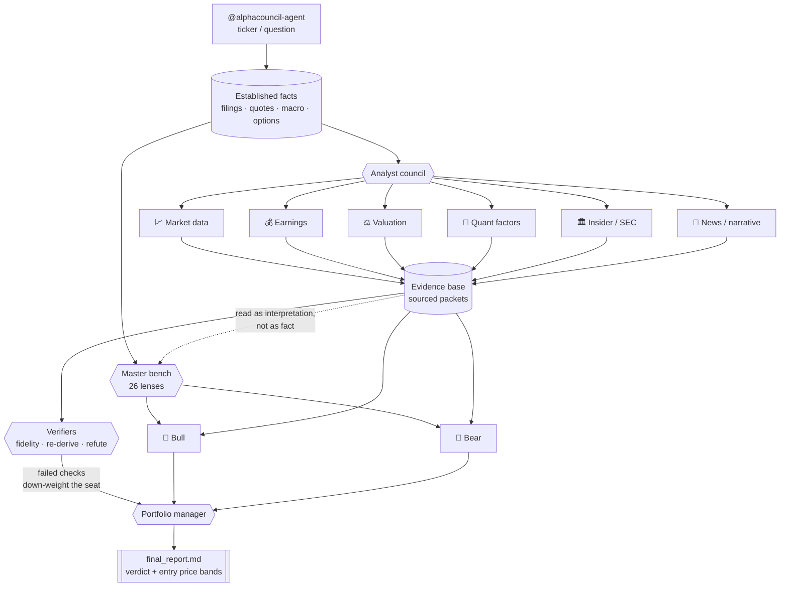

<a name="readme-top"></a>

<div align="center">


<p>
  
</p>

**English** · [中文](README.zh-CN.md) · [日本語](README.ja.md)

<p>
  
  
  
  
</p>
<p>
  
  
  
  
</p>
<p>
  
  
  
</p>

<p>
  <a href="../INSTALL.md"><b>Install</b></a> ·
  <a href="#-usage"><b>Usage</b></a> ·
  <a href="#-tools--34-all-keyless"><b>Tools</b></a> ·
  <a href="#-the-bench--26-investor-method-lenses"><b>The bench</b></a> ·
  <a href="#-architecture"><b>Architecture</b></a> ·
  <a href="../../CHANGELOG.md"><b>Changelog</b></a> ·
  <a href="#-disclaimer"><b>Disclaimer</b></a>
</p>

</div>

---

<div align="center">


<sub><i>A real run, in real time. Want the still version? <a href="../../assets/run-example.png">Six lenses reaching the same call for different reasons</a> · <a href="../examples/final_report.SOX.zh.md">a complete real report</a> (SOX, full council, zh)</i></sub>

</div>

**Ask an LLM "is this stock a buy" and you get one confident paragraph of training-data
vibes. Ask AlphaCouncil and you get an argument** — eight core or eleven all-scope evidence
agents pull the primary
sources, twenty-six investor-method lenses read the same facts and disagree in public,
bull and bear cross-examine each other for three rounds, and a portfolio manager signs a
verdict with entry bands and the conditions that would invalidate it. Every claim traces
to a source ID; a method whose inputs are missing says so instead of guessing.

Watch it happen live: the bundled [terminal client](#terminal-client-tui) plays the
council as a meeting transcript — each master speaking under a stance-colored name,
statements typing out character by character.

AlphaCouncil integrates with Codex, Claude Code, OpenCode, and Grok Build. Full council is
the default; an explicitly requested `quick` run uses a smaller, plugin-managed headless
contract. Both gather sourced evidence, run selected method seats and produce an auditable
portfolio-manager report.

### ✨ Why AlphaCouncil

| | |
|---|---|
| 🏛️ **A council, not one opinion** | Eight specialist analysts by default, eleven available — market data, earnings, forward expectations, quant, valuation, news and supply chain, insider/SEC, IB events, macro, narrative, crowding. |
| 🎭 **26 selectable investor lenses** | Buffett, Munger, Graham, Lynch, Marks, Damodaran, Ackman, Cathie Wood, Pabrai, Bogle and more read the **same facts** through different stated research priorities. Every council run shows all 26 with actual maturity before research. Full accepts any non-empty selection or `all`; quick requires 1-4 and rejects `all`. |
| 🧺 **A basket is not a company, and the bench knows it** | An ETF or index is priced by look-through: a fund owning 1% of a business has a claim on 1% of its owner earnings, so a company method reads a basket **without changing its method**. Ratios aggregate by weight; absolute figures become the fund's own dollar claim; a share count is refused because it has no portfolio meaning. |
| 📰 **A basket gets its own industry news** | `SOX` has no press office. Its industry is derived from the weighted SIC groups of its holdings, so SOXX resolves to semiconductors and survives a rebalance. Where no group dominates, the basket is queried as the several industries it actually is. |
| 🌏 **What else you are betting on** | Correlation to the broad market, to KOSPI, to KOSDAQ and to the semiconductor cycle, plus dispersion across the eleven sector SPDRs. Sessions pair by date, because Korea and the United States keep different holidays. |
| 💵 **Fund flow that refuses to be faked** | Creations minus redemptions, priced. Only a filed share count or the issuer's own assets-over-NAV identity may price a flow; a count reconstructed from positions is refused, because a difference cancels the number and keeps the error. |
| 🐂🐻 **Adversarial by design** | Full runs a three-round bull/bear cross-exam. The exact `slow + all methods + all analysts` path must first pass `source_fidelity`, independent `rederivation`, and `refuter` over every material claim; zero verifier verdicts means `needs_verification`, never `complete`. Quick explicitly does not claim adversarial verification. |
| ⏱️ **You pick the depth: 15, 30 or 60 minutes** | The run asks before it starts and shows the persistence ceiling, configured stage budget and live-verification status for each tier — you never type a speed. These are deadlines, not measured completion promises. Method seats and analyst breadth are separate choices: `core` runs 8 analysts, `all` runs exactly 11. |
| 🔍 **Auditable, never hallucinated** | Every claim maps to a source ID. A screen rule with missing inputs is `skipped`, never a pass. An undated headline is excluded, not shown as recent. Gaps are a section, not an omission. |
| 📚 **One complete company dossier for every downstream seat** | A full operating-company run accounts for the fixed 52-item core roster, freezes `company_dossier.json`, and gives the same hash-bound artifact to every selected method, every Bull/Bear round and the PM. Each method returns a task/hash/status receipt for all selected packets: 8 in `core`, 11 in `all`. Critical missing data stops the decision instead of disappearing inside a summary. |
| 🧭 **Company, ETF and index routing** | The symbol is classified before research. Companies use issuer financials; ETFs use dated holdings look-through; indices use aggregate methodology. QQQ/SPY are never treated as companies with their own revenue or EPS. |
| 💰 **Entry price bands, not one number** | Three conditional bands with what each depends on. "The cycle position is undetermined" changes what the bands are conditional on; it does not excuse leaving them out. |
| 🔑 **34 tools, zero API keys, zero runtime dependencies** | SEC EDGAR, issuer IR discovery, adaptive company feeds, CBOE options, Yahoo/Stooq quotes, 21 macro series, news and social — all keyless. `node mcp/server.mjs` and nothing else. |
| 🖥️ **One contract on four hosts** | Claude Code, Codex, OpenCode and Grok Build share the same selection, evidence and reporting gates. Quick is always executed by the plugin-managed headless `analyze_symbol` path. |

This repository is the uploadable source copy. Runtime outputs are written outside the repo under `~/.alphacouncil-agent/runs/<run_id>/`.

## What this ships

`npm install -g alphacouncil-agent` installs npm's current public `latest`, which may lag this
source candidate. `npm run release:public:audit` reports source, main, candidate PR, GitHub
Release, About and npm as separate layers.

Twenty-six method seats, each running its own formulas and its own thresholds against typed
facts built from SEC filings, FRED series, issuer holdings disclosures, published index
aggregates, Section 16 ownership, cross-market price history and dated industry news.
Fifty-two executable method tools.

Deterministic and fixture-backed checks exercise each seat's policy, typed-fact and abstention
paths. They do not prove a live 26-seat terminal run, method fidelity or usefulness. The current
formal counters remain 0/8 registered canonical evaluation runs and 0/4 live-host E2E runs.

Honesty note: seat formulas are AI-authored reconstructions of named published methods,
pending human review — the governance status and what remains open are tracked in
[the v1.0.0 release contract](../releases/v1.0.0.md), and `npm run check` prints
exactly where that stands.

Trust posture: zero runtime dependencies, no install scripts, no telemetry, every data
source keyless and public; analyst workers run in a read-only sandbox
(`codex exec -s read-only -a never --ephemeral`). Details in [SECURITY.md](../../SECURITY.md).

See [the v1.0.0 release contract](../releases/v1.0.0.md) for the exact ETF/index and full/quick
boundary and [the report contract](../report-contract.md) for `quick_v1` versus `full_v2`.

## 📜 Disclaimer

This software is for **educational and research purposes only**. It is **not
investment advice**, not a recommendation to buy or sell any security, and not a
solicitation. AI-generated analysis can be incomplete, outdated, or wrong. Do
your own research and consult a licensed financial professional before making any
investment decision. The authors accept no liability for any loss.

## Install

See **[docs/INSTALL.md](../INSTALL.md)** for Codex, Claude Code, OpenCode, and Grok Build
setup. **Windows users:** see the [Windows section](../INSTALL.md#windows).

**Prerequisites:** Node.js >= 18. The headless research path also needs an
installed, authenticated **Codex CLI** (each analyst worker runs as `codex
exec`). On Windows, v0.3.0+ launches the CLI through `cmd.exe` and feeds prompts
over stdin so native `codex.cmd` installs work without WSL in the normal case.

```text
# Codex
codex plugin marketplace add Zhao73/alphacouncil-agent
codex plugin add alphacouncil-agent@alphacouncil

# Claude Code
/plugin marketplace add Zhao73/alphacouncil-agent
/plugin install alphacouncil-agent@alphacouncil
/reload-plugins
```

**First run, 30 seconds, zero model spend** — before committing to a full council,
verify the data layer works:

```text
# Codex
@alphacouncil-agent AAPL news

# Claude Code, OpenCode, or Grok Build
/alpha AAPL news
```

That calls only keyless data tools and spawns no subagents. When it returns dated
headlines and filings, the install is good. In Codex, try a full council with
`@alphacouncil-agent analyze AAPL`; on the three slash-command hosts, use `/alpha AAPL`.
Note the headless full/quick paths additionally need an authenticated **Codex CLI**
(each analyst worker runs as `codex exec`) — Claude Code without Codex uses the
visible host-subagent path instead, see [docs/INSTALL.md](../INSTALL.md).

## 🚀 Usage

Just talk to it. Mention the agent and a ticker or a question:

```text
@alphacouncil-agent analyze AAPL as a long/short pitch
@alphacouncil-agent is AAPL a buy at current levels?
@alphacouncil-agent compare TSLA vs RIVN for a 12-month horizon
@alphacouncil-agent 帮我看看 700.HK 现在能不能买
@alphacouncil-agent トヨタ(7203)を分析して
```

You get back a single, chat-readable report:

```text
VERDICT: Overweight  (confidence: medium)
├─ Analyst work log ........ 11 evidence agents, 38 sourced claims
├─ Bull thesis ............. demand inflection, margin expansion, buyback
├─ Bear thesis ............. valuation, customer concentration, cycle risk
├─ Short / medium / long ... 1-4wk · 3-6mo · 12mo views
├─ Catalysts & risks ....... earnings, guidance, regulatory
├─ Data gaps ............... explicitly listed, never hidden
└─ Source table ............ every claim mapped to <task>:<source_id>
```

The concise handoff is written to `~/.alphacouncil-agent/runs/<run_id>/user_response.md`.
The full report is written to `~/.alphacouncil-agent/runs/<run_id>/final_report.md`,
with analyst Markdown files and `artifact_index.md` in the same run directory. Full handoff
shows the system quote (or an explicit quote-data gap), every receipt-bound analyst status/summary,
and every selected method seat's frozen stance plus readable explanation/status. Its final
section is a system-gated ledger: completed seats retain their full, untruncated statement;
failed seats explicitly say that no directional view was produced and why. `all` therefore
accounts for all 26 selected IDs without manufacturing votes. These are provisional
method-seat outputs, never quotes from the named people. If a visible hard gate fails,
`finalize_visible_run` closes the run as `incomplete` and returns this same handoff; the host
must not replace it with a shorter manual recap.

For a full operating-company decision, the directory also contains `company_dossier.json`:
the 8 core packets plus any 3 all-scope packets, the fixed 52-item core coverage ledger, source/claim lineage,
typed facts and one canonical hash. Compact prompt evidence is only an index; downstream seats
must read and acknowledge this same complete artifact before their output is accepted.

### Slash commands (Claude Code, OpenCode, and Grok Build)

**One command, `/alpha`.** Modes are arguments, so there is one name to remember
rather than four in a menu of a hundred.

| Invocation | What runs | Model spend |
|---|---|---|
| `/alpha <ticker>` | Asks the depth tier with its persistence ceiling and unvalidated live-completion status, shows every master, confirms `1..N`/ranges/`all`, then full | deterministic stance + one isolated strong-first-person voice worker per selected v3 seat, including `out_of_scope` |
| `/alpha <ticker> quick` | Shows all 26, confirms 1-4 (no `all`), then plugin-managed `quick_v1` (≤10m) | varies with selection |
| `/alpha <ticker> screen` | Mechanical filings screen only | **none** |
| `/alpha <ticker> options` | IV term structure, skew, positioning | **none** |
| `/alpha <ticker> news` | Dated filings and headlines | **none** |
| `/alpha market <theme>` | What the market is talking about | **none** |
| `/alpha` | Lists the modes and stops | **none** |

The four marked **none** call keyless data tools and spawn no subagents, so they cost
nothing beyond the turn you type them in. Full and quick first display every master with a
number, identity, method and best-use case. A native multi-select may make that easier, but
all four hosts support the same numbered text fallback. Full accepts `all`; quick accepts
only 1-4 distinct seats and rejects `all`. Even a request that already names a master must
show the catalog and confirm a fresh, one-use, mode-bound receipt before research starts.

Any listed equity: `/alpha AAPL` · `/alpha 0700.HK quick` · `/alpha 7203.T news` · `/alpha market rates`.
Filings-based modes need a US filer; other markets are reported through `market_coverage` rather than silently returning nothing.

### Full v2 — three depth tiers, chosen at the gate

The run asks how deep to go before it asks which methods to seat. You never type a speed:
`begin_council_selection` returns the persistence ceiling, configured stage budget and
`observed_completion_status` for each tier. A configured budget is not an observed duration.

| tier | persistence ceiling | observed complete run | evidence / seat | debate / round / side |
| --- | --- | --- | --- | --- |
| `fast` | 15 min | not validated | 3.5 min | 90 s |
| `normal` (default) | 30 min | not validated | 6 min | 150 s |
| `slow` | 60 min | not validated | 12 min | 6 min |

**All three are the same `full_v2` contract** — the separately selected 8- or 11-seat analyst
roster, every selected method, three debate rounds and the PM. A tier changes how long each seat
may think, never which seats run.
The ceiling guarantees terminal persistence, including an explicit `incomplete` result; it does
not promise successful completion. No tier receives a completion-time claim until preregistered
live terminal evidence exists.

A tier moves every per-stage cap together with the total, and it also shapes what each worker is
asked to produce. That second half matters: a cap on its own is a timeout, and the same prompt
with a shorter fuse buys a packet the worker could not finish rather than a faster good one.
Since an LLM call's wall clock is dominated by the tokens it generates, `fast` asks for the same
information in less prose — claims, figures, scoped source IDs, required report sections and the
decision are never what gets cut; restatement is. `slow` buys room to write a derivation out
step by step.

The chosen tier binds into the one-use `selection_receipt`, so an execution call may repeat it
but never change it: a run approved as fifteen minutes cannot become an hour, and `status.json`
records which tier produced it. Quick has no tier — it is a smaller contract, not a slower one.

All receipt-bound evidence workers start in one parallel wave. After the evidence barrier,
each selected physical v3 method freezes its deterministic stance and then gets one isolated
voice worker that explains, but cannot change, that result in a strong method-specific first
person. This includes a frozen abstention. Bull and
Bear run in parallel within each of the three rounds, with a barrier between rounds, followed by
the PM.

At expiry the server persists `incomplete` with every timed-out, failed and skipped role. The
tier's ceiling is a terminal-persistence guarantee, not a promise that search, model transport or
data providers will let every seat succeed. A visible-host `plan_visible_run` is scheduled
outside the plugin and cannot be force-stopped, so it carries no time claim at all.

The resulting full handoff names every selected stable master ID and all 8 or 11 analysts, and
includes a system-owned price snapshot or explicit unavailable-data record. Method-seat
voice is a recorded provisional lens explanation, not a quote, endorsement or current
statement by the named person. System-owned output supports Chinese (`zh-CN`), English,
Japanese and Korean; each worker receives the run language.

### Quick v1 — bounded, not full

Quick is never inferred from impatience or a full-run failure. It runs only through the
plugin-managed headless `analyze_symbol(council_mode="quick")`; `plan_visible_run` rejects
quick. After the complete 26-seat display and a 1-4-seat confirmation, it executes:

1. `market_data`, `earnings_deep_dive`, `valuation_long_short` and
   `news_industry_management` in one parallel wave;
2. the 1-4 selected method seats in one parallel wave;
3. one Bull and one Bear statement in parallel, then one short PM;
4. deterministic `quick_v1` report assembly and standard artifacts.

Recent company and industry news must be dated inside the 120 days ending at `as_of`;
future, undated and older items are excluded from recent news and recorded as gaps. The hard
queue-to-persistence ceiling is **600000 ms**: grounding wait 20s; each parallel evidence
worker 210s; each parallel method worker 90s; Bull and Bear 90s per side; PM 90s; final
assembly/persistence reserve 20s. Retries consume the same caps and global clock.

Quick has no round-2 rebuttal, round-3 exact Q&A or adversarial
`source_fidelity`/`rederivation`/`refuter` fan-out. It may terminate `degraded` only under its
explicit coverage rules and system-owned degraded ledger; otherwise missing required work is
`incomplete` or `failed`. `report_quality=passed` means the `quick_v1` structure passed—it
does not make the run complete or equivalent to `full_v2`. A method-seat result is a
recorded provisional lens output, never a quotation from the named person.


Codex uses the bundled Skill instead of this slash-command surface:
`@alphacouncil-agent AAPL`, `@alphacouncil-agent AAPL quick`, or
`@alphacouncil-agent AAPL news`. No user-scoped prompt copy is required.

## What It Does

Default stock-analysis runs are full runs, not lite summaries:

- Market data and price action
- Earnings deep dive, including the earnings call
- Forward expectations, implied beat/miss thresholds, and sell-side target revisions
- Quant factor view: momentum, trend, volatility, liquidity, relative strength, crowding
- Valuation and long/short pitch, with price bands rather than a single target
- News, industry context, supply chain, and management's words checked against their actions
- SEC filings, Form 4 insider transactions, buybacks, dilution, debt and capital allocation
- Investment-banking event analysis for M&A, ECM, debt, buybacks and strategic transactions
- A fixed 52-item operating-company dossier with explicit covered, unavailable or genuinely
  not-applicable status for every decision-relevant domain
- A selectable bench of 26 investor method lenses reading the same facts
- Bull researcher, bear researcher and portfolio-manager synthesis

Full is fail-fast at its mandatory evidence barrier. If a required evidence role still
fails after the one bounded parse-only repair, the run persists the failure and diagnostic
artifacts, skips selected-method, debate and PM model calls, and terminates `incomplete`.
It does not spend downstream synthesis time on a run that cannot satisfy `full_v2`.

The final report is readable directly in chat. It carries analyst work logs, data and filing
summaries, the bull/bear debate, the PM verdict, entry price bands, short/medium/long-term
views, data gaps, confidence and a source table.

## 🔧 Tools — 34, all keyless

Nothing below needs an API key, an account, or a config file. Install and run.

| Area | Tools | Source |
|---|---|---|
| **Instrument + filings** | `compose_research_brief` `screen_ticker` `screen_candidates` `list_us_universe` | Company/ETF/index classification; SEC EDGAR XBRL only where applicable |
| **Non-US filings** | `market_financials` `market_coverage` | TWSE keyless; DART/EDINET on a free key; HK/CN documents only |
| **Market data** | `get_quote` `get_macro_snapshot` | Yahoo / Stooq, 21 macro series + 5 derived |
| **Options** | `get_options_chain` | CBOE delayed quotes — IV term structure, 25-delta skew, open interest, Greeks |
| **Company sources + news** | `get_company_sources` `get_news` `get_market_narrative` | SEC profile/filings, issuer IR discovery and excerpts, adaptive Yahoo/Google/issuer feeds, Fed, WSJ, CNBC |
| **Social** | `get_social_pulse` `verify_x_post` | Reddit, Hacker News, Bluesky |
| **Industry** | `industry_brief` `industry_peers` `industry_coverage` `list_industries` | SIC across all US filers + curated maps |
| **Workflow** | `analyze_symbol` `plan_visible_run` `collect_evidence` `read_run` and 5 more | — |

**What it deliberately will not do.** Every one of these is stated in the tool output itself,
not only in the docs, because the payload is what gets quoted downstream:

- **IV percentile needs accumulated observations.** Valid daily snapshots are saved locally;
  fewer than 60 distinct trading days stays `building_history`, never a fabricated percentile.
- **X / Twitter has no free discovery channel** as of 2026-07. Nitter search is dead, the X
  API bills per post and xAI bills per call. Professional FinTwit is **not** covered, and
  Reddit is not a substitute for it.
- **A screen rule whose inputs are missing is `skipped`, never a pass.**
- **A news item with no parsable timestamp is excluded**, not shown as recent.
- **A contract reporting `iv = 0`** — CBOE does this for expired and deep-in-the-money
  contracts — is dropped rather than averaged in, because a zero does not look like a gap,
  it looks like a calm stock.

## 🏛️ The bench — 26 investor method lenses

Reconstructions of publicly documented methods, not anything the named people said. Each
states how it thinks, what it notices first, its characteristic challenge, and **its own
failure mode** — a seat that cannot name how it goes wrong will not flag it when it does.

Why “seat”? It is the council's stable selection and accounting slot: one method ID, one
fact contract, one result or explicit failure, and one final-ledger entry. It does not mean
the person is present, that every seat is a separate model/source, or that 26 seats are 26
independent samples. Reader-facing text calls them method lenses; internal protocols retain
`seat` because it precisely names that orchestration obligation.

| Roster | Lenses |
|---|---|
| Value | Buffett · Munger · Duan Yongping · Li Lu |
| Classic value | Graham · Fisher · Lynch · Marks · Klarman |
| Adversarial | Soros · Druckenmiller · Dalio · Burry · short seller |
| Quant | Simons · Asness · Thorp |
| Options | Taleb · Natenberg · Sinclair |
| v3 expansion | Damodaran · Ackman · Cathie Wood · Pabrai · Bogle · Jhunjhunwala |

The `solo_test` catalog has 26 selectable physical v3 packs, but **26 physical packs is
not 26 approved method models**. Every seat is a provisional `operator_lens` backed by
project-derived proxy material; the 52 method tools are executable test proxies, not human-approved
formula attribution. Operational and `method_model` counts are both zero, and production GA
remains fail-closed.

`skills/alphacouncil-method-lenses` adds one router plus 26 on-demand, hash-bound method
references for methodology comparisons and frozen-result explanations. It deliberately avoids
26 globally triggered Skills and third-party runtime dependencies. Every reference uses a strong
first-person public-method simulation—verdict first, characteristic vocabulary, reasoning order,
and failure mode—while the short `AI public-method simulation` label distinguishes it from a quote. The
references remain `method_reference_provisional`; they do not replace the deterministic packs.
The public-Skill A/B pilot and the presentation mechanics adopted from it are recorded in
[docs/evaluation/method-skill-pilot-2026-08-03.md](../evaluation/method-skill-pilot-2026-08-03.md).

Masters read the **same established facts** the analysts read — filings, quotes, financials,
macro — and receive the analyst packets separately, labelled as other seats' readings rather
than as fact. That separation is the point: the bench is worth having only because Munger
looks at incentives where an analyst looked at margins. See [docs/attribution.md](../attribution.md).

Every selected seat gets its own isolated voice worker, including `out_of_scope`. The council UI
renders the project-derived result in strong first person: action verdict first, then what I see,
how my method reads it, where I disagree, and what changes my mind. The method's distinctive
questions, vocabulary, reasoning order and failure mode are required; a neutral “Buffett would”
summary is rejected. Each independently readable surface carries one short `AI public-method
simulation` label. It is not evidence of the person's words, endorsement, private reasoning,
current view or holding.

## 🧩 Architecture

The diagram below is the full/deep path. Quick retains the Master Bench but uses its fixed
four-role evidence wave, one parallel Bull/Bear statement round and short PM; it does not run
the verifier node shown here.



The masters branch off the facts, not off the packets. Feeding 26 lenses one analyst's
selection of what mattered would give them all the same blind spot — a large and perfectly
correlated error — and would remove the reason for having a bench at all.

Key files:

- `.codex-plugin/plugin.json` - Codex plugin metadata.
- `codex.mcp.json` - isolated Codex MCP server wiring.
- `assets/logo-icon.png` - plugin icon used by Codex.
- `skills/alphacouncil-agent/SKILL.md` - runtime instructions for Codex.
- `mcp/server.mjs` - JSON-RPC MCP server and workflow implementation.
- `scripts/selfcheck.mjs` - minimal regression check.

## 🆚 Codex vs Claude Code edition

For full council, both editions share the same workflow, JSON packet contract, audit artifacts, the no-API-keys / live-web evidence model, and the same disclaimer. The Claude Code edition changes only *how* the full council is run. Quick does not use visible host orchestration on either edition; it always uses the plugin-managed headless path.

| | Codex edition | Claude Code edition |
|---|---|---|
| Council execution | plugin-managed `codex exec` workers; full headless ≤15/30/60m by chosen tier | Host-owned `Task` subagents; no plugin-enforced deadline at all |
| Quick `quick_v1` | Plugin-managed headless `analyze_symbol` | Same plugin-managed headless `analyze_symbol` |
| Per-analyst context | Separate process | Separate subagent, full isolated context window |
| Evidence | `codex exec --search` | `WebSearch` + `WebFetch` in each analyst's own context |
| Evidence → debate | Eight-role parallel wave, then hard barrier | Hard barrier on the run's phase machine |
| Debate depth | 3 rounds (case / rebuttal / Q&A), bull + bear parallel per round | 3 rounds, bull + bear in parallel per round |
| Claim verification | Missing-source gate (run flagged, report banner) | + per-claim adversarial verify: re-fetch cited URL, re-derive, refute *(host-driven)* |
| Full-run enforcement | Incomplete runs marked `incomplete` (server gate) | Same gate, plus a hard barrier before debate |
| Model & cost | One model | **Pick per role** — evidence on Sonnet, debate/verdict on Opus 4.8 (or all-Opus / all-Sonnet) |
| Language | `zh-CN`/English/Japanese/Korean system copy; workers get run language | User's language across every subagent + the live workflow |

**Honest scope:** same model family, same prompts, same audit contract — the win is context isolation, always-on parallel fan-out, and deterministic gates, *not* a smarter model. As of **v0.3.0** the shared server runs the 3-round debate, enforces missing-source / full-run / report-quality gates, writes concise and full report artifacts, and supports native Windows Codex CLI launching. As of **v0.3.1**, the plugin also bundles `agent-skills-governance`, an `addyosmani/agent-skills`-style anti-laziness skill with explicit stop gates and exit criteria. The Claude Code edition adds parallel per-round execution and host-driven per-claim verification. Live-web staleness and paywalls limit both editions equally.

## Data Contract

Evidence agents return JSON packets:

```json
{
  "task": "market_data",
  "symbol": "AAPL",
  "as_of": "YYYY-MM-DD",
  "summary": "string",
  "claims": [
    {
      "claim": "string",
      "evidence": "string",
      "confidence": "high|medium|low",
      "source_ids": ["market_data:S1"]
    }
  ],
  "metrics": {},
  "sources": [
    {
      "id": "market_data:S1",
      "title": "string",
      "url": "https://example.com",
      "published_at": "YYYY-MM-DD or unknown",
      "retrieved_at": "YYYY-MM-DD"
    }
  ],
  "open_questions": ["missing data item"],
  "confidence": "high|medium|low"
}
```

All source IDs are task-scoped as `<task>:<source_id>`. Missing data must be reported in `open_questions` and in the final report's data-gap section.

## Terminal Client (TUI)

Watch the council deliberate as a live meeting transcript, without leaving the
terminal. Each seat speaks under its own name with a stance-colored tag, the current
statement types out character by character, and finished statements collapse to an
excerpt and scroll up — plain text that renders identically on every terminal:

```bash
npm run tui                 # latest run; live-tails if still running
npm run tui -- <run_id>     # a specific run
npm run tui -- --replay     # animate a finished run in completion order
```

On start it asks for a UI language (English default · 中文 · 日本語 · 한국어), or pass
`--lang en|zh|ja|ko` — Chinese and Japanese localize the master names too
(芒格、タレブ…). Statements render in the language the council ran in.

Keys: `q` quit · `space` pause · `→` finish typing · `n` next speaker.
A statement is a recorded provisional method output; the named person never spoke it.

## Run Viewer (local GUI)

Every run persists its full artifact tree under `~/.alphacouncil-agent/runs/<run_id>/`.
The bundled viewer makes those reports browsable — a zero-dependency local server,
loopback-only, strictly read-only:

```bash
npm run gui
# → http://127.0.0.1:7999
```

It lists every run with status and mode, renders `final_report.md`, per-seat statements
and the debate record, and can auto-refresh while a council is still running.

## Run Locally

```bash
npm run check
```

The check validates:

- MCP server syntax
- tool schema exposure
- source ID scoping
- default real-run behavior
- visible-run recording
- `events.jsonl`, `status.json`, `all_agents.md`, `source_manifest.json`
- `final_report.md`, `user_response.md`, `artifact_index.md`, `report_quality.json`
- one Markdown file per evidence analyst plus bull, bear, and portfolio manager
- final report includes analyst work log, bull/bear debate record and data gaps

## Codex Install Shape

The plugin expects this local layout:

```text
.codex-plugin/plugin.json
codex.mcp.json
skills/alphacouncil-agent/SKILL.md
mcp/server.mjs
scripts/selfcheck.mjs
package.json
```

`codex.mcp.json` runs:

```json
{
  "mcpServers": {
    "alphacouncil-agent": {
      "command": "node",
      "args": ["./mcp/server.mjs"],
      "cwd": "."
    }
  }
}
```

## Notes

This is an independent Codex plugin implementation. It uses a multi-agent investment-committee workflow: analyst teams, evidence sharing, bull/bear debate and portfolio-manager synthesis.

No API keys, brokerage credentials, private filings or generated run artifacts should be committed.

## ⭐ Star History

<div align="center">

<a href="https://star-history.com/#Zhao73/alphacouncil-agent&Date">
  
</a>

<br/><br/>

<picture>
  <source media="(prefers-color-scheme: dark)" srcset="../../assets/logo-dark.png" />
  
</picture>

If AlphaCouncil saved you time, consider leaving a ⭐ — it genuinely helps.

<a href="#readme-top">↑ Back to top</a>

</div>
