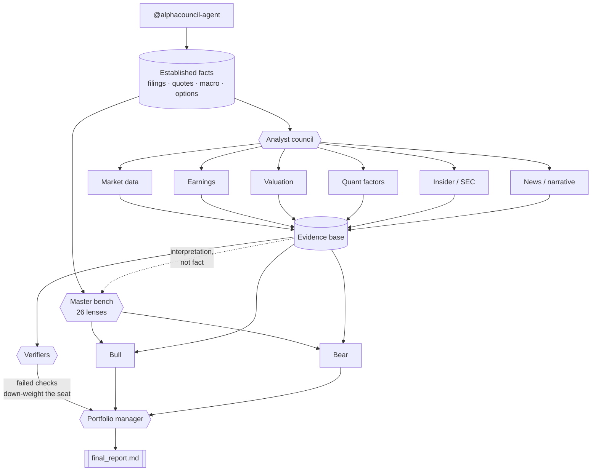

<a name="readme-top"></a>

<div align="center">


### ターミナルの中の、マルチエージェント投資委員会

アナリスト評議会を招集 → 出典付きの根拠を収集 → 強気/弱気ディベート → PM が判定:**買い · オーバーウェイト · 中立 · アンダーウェイト · 売り**

[English](README.en.md) · [中文](README.zh-CN.md) · **日本語**

<p>
  
  
  
  
</p>
<p>
  
  
  
</p>

<p>
  <a href="#-使い方"><b>使い方</b></a> ·
  <a href="../INSTALL.md"><b>インストール</b></a> ·
  <a href="#-アーキテクチャ"><b>アーキテクチャ</b></a> ·
  <a href="#-免責事項"><b>免責事項</b></a>
</p>

</div>

---

<div align="center">


<sub><i>実際の実行の録画。静止画版:<a href="../../assets/run-example.png">6つのレンズが異なる理由で同じ結論へ</a> · <a href="../examples/final_report.SOX.zh.md">完全な実レポート</a>(SOX、full council、中国語)</i></sub>

</div>

AlphaCouncil Agent は、**Codex、Claude Code、OpenCode、Grok Build** の 4 ホストに対応する上場株式リサーチ委員会です。既定はフル委員会で、ユーザーが明示的に `quick` を指定した場合だけ、より小さいプラグイン管理の headless 契約を使います。どちらも出典付きの根拠を集め、選択したメソッド席を実行し、監査可能な PM レポートを生成します。

### ✨ AlphaCouncil を使う理由

| | |
|---|---|
| 🏛️ **一人の意見ではなく、委員会** | フルは既定 8 根拠席（最大 11）、quick は固定 4 根拠席を並列実行。どちらも調査前に 26 メソッド席をすべて表示。 |
| 🐂🐻 **設計からして対立的** | フルは 3 ラウンドの強気/弱気クロス審問。quick は強気・弱気を 1 回だけ並列実行して短い PM に渡し、敵対的 verifier を実行したとは主張しません。 |
| ⏱️ **深さは 15 / 30 / 60 分から選択** | メソッド席、分析席範囲（core 8 / all 11）、深さを別々に確定します。表示するのは永続化上限、設定済み段階予算、実測検証状態であり、設定予算を予想所要時間とは呼びません。 |
| 🔍 **監査可能、幻覚なし** | すべての主張が source ID に紐づく。欠落データは「データ欠落」セクションに明示し、決して隠さない。 |
| ⏱️ **マルチ期間の判定** | 買い/中立/売りに加え、1〜4週・3〜6か月・12か月の見通しを個別に提示。 |
| 🔑 **データベンダー不要・APIキー不要** | 金融データ API・マーケットデータフィード・証券口座ログインは一切不要。アナリストはエージェント自身のウェブ検索(**Codex のウェブ検索** / **Claude Code の WebSearch + WebFetch**)で根拠をリアルタイムに収集 —— 課金は既存の Codex / Claude Code サブスクのみ。MIT ライセンス。 |
| 📚 **同梱の調査プレイブック** | 公開株式投資と投資銀行イベント分析の方法論を**ローカルスキル**として同梱(`skills/public-equity-investing`、`skills/investment-banking`)—— Codex 専用のリモートワークフローに依存せず、Claude Code でも同等の調査深度。 |
| 📈 **実マーケットデータ・キー不要** | 内蔵の `get_quote` が Yahoo + Stooq 経由で指数・指数先物(夜間含む)・FX・金利・ボラ・商品・個別株の遅延(~15分)データを取得 —— API キー不要、アナリストは推測ではなく実数を引用。 |

このリポジトリはアップロード用のソースコピーです。実行成果物はリポジトリの外、`~/.alphacouncil-agent/runs/<run_id>/` に書き出されます。

## 現在のソース候補に含まれるもの

`npm install -g alphacouncil-agent` は npm で現在公開されている `latest` をインストールし、
このソース候補より遅れている場合があります。`npm run release:public:audit` はソース、main、
候補 PR、GitHub Release、About、npm を別レイヤーとして報告します。

26 の手法シートが、それぞれ自分の数式と自分のしきい値で判断します。読み込むのは SEC 提出書類、
FRED 系列、発行体の保有銘柄開示、公開されている指数集計値から構築した型付きファクトです。
実行可能ツールは 52。決定論テストと fixture は各席の policy、型付きファクト、棄権経路を
検査しますが、実際の 26 席終端実行、手法忠実度、有用性を証明しません。正式な件数は現在も
登録済み標準評価 0/8、実ホスト E2E 0/4 です。

シートの admission レベルは `operator_lens` です。数式としきい値は AI が起草し、実名の公開
著作に遡れますが、**人間によるレビューは未実施**で、実機 4 ホストのエンドツーエンド実行も
**未実施**です。したがってコーパスは検証済み `method_model` を **0**、承認署名を **0** と
報告し、production assembly は当該作業が完了するまで fail-closed のままです。
現状は `npm run check` が正確に出力します。

ETF・指数および full/quick の正確な境界は [v1.0.0 リリース契約](../releases/v1.0.0.md)、
`quick_v1` と `full_v2` の違いは [レポート契約](../report-contract.md) を参照してください。

## 📜 免責事項

本ソフトウェアは**教育・研究目的のみ**を対象としており、**投資助言ではありません**。いかなる証券の売買の推奨・勧誘でもありません。AI が生成する分析は不完全・古い・誤っている可能性があります。投資判断の前に、必ずご自身で調査し、有資格の専門家にご相談ください。作者はいかなる損失についても責任を負いません。

## インストール

Codex、Claude Code、OpenCode、Grok Build の完全なセットアップ手順は
**[docs/INSTALL.md](../INSTALL.md)** を参照してください。**Windows ユーザー**は [Windows セクション](../INSTALL.md#windows) を参照。

**前提条件:** Node.js ≥ 18。headless でリサーチを実走させるには、**インストール済みかつ認証済みの Codex CLI** も必要です(各アナリスト worker は `codex exec` として起動します)。Codex が無い場合は、インストールガイドの **visible ワークフロー**を使ってください。

```text
# Codex
codex plugin marketplace add Zhao73/alphacouncil-agent
codex plugin add alphacouncil-agent@alphacouncil

# Claude Code
/plugin marketplace add Zhao73/alphacouncil-agent
/plugin install alphacouncil-agent@alphacouncil
/reload-plugins
```

**まず 30 秒・コストゼロで動作確認** —— フル評議会を回す前に、データ層の疎通を確認します:

```text
# Codex
@alphacouncil-agent AAPL news

# Claude Code、OpenCode、Grok Build
/alpha AAPL news
```

これはキー不要のデータツールのみを呼び、サブエージェントを一切起動しません。日付付きの
ニュースと開示が返ればインストール成功です。Codex では
`@alphacouncil-agent AAPL を分析`、ほかの 3 ホストでは `/alpha AAPL` でフル評議会を実行します。
なお headless のフル/クイック経路には認証済みの **Codex CLI** が別途必要です
(各アナリストワーカーは `codex exec` として動作)。Claude Code のみの場合は可視
サブエージェント経路になります。詳細は [docs/INSTALL.md](../INSTALL.md)。

## 🚀 使い方

エージェントにそのまま話しかけるだけ。@ でエージェントを呼び、ティッカーや質問を添えます:

```text
@alphacouncil-agent 7203.T をロング/ショートのピッチとして分析して
@alphacouncil-agent 現在の水準で AAPL は買い?
@alphacouncil-agent 12か月の視点で TSLA と RIVN を比較して
@alphacouncil-agent トヨタ(7203)を分析して
@alphacouncil-agent 帮我看看 700.HK 现在能不能买
```

チャット上でそのまま読める 1 本のレポートが返ってきます:

```text
判定:オーバーウェイト  (確信度:中)
├─ アナリスト作業ログ .... 11 の根拠エージェント、出典付き主張 38 件
├─ 強気シナリオ .......... 需要の転換点、マージン拡大、自社株買い
├─ 弱気シナリオ .......... バリュエーション、顧客集中、サイクルリスク
├─ 短期 / 中期 / 長期 .... 1〜4週 · 3〜6か月 · 12か月の見通し
├─ カタリストとリスク .... 決算、ガイダンス、規制
├─ データの欠落 .......... 明示的に列挙し、決して隠さない
└─ 出典テーブル .......... すべての主張を <task>:<source_id> に対応付け
```

簡潔なユーザー向け要約は `~/.alphacouncil-agent/runs/<run_id>/user_response.md` に書き出されます。最後はシステム検証済みの席別台帳で、完了した席は全文を省略せず表示し、失敗した席は方向性判断を生成していないことと終了理由を明示します。可視実行のハードゲートが失敗した場合は `finalize_visible_run` が `incomplete` として正式に終了し、同じ要約を返します。ホストは短い手動要約に置き換えません。
完全なレポートは `~/.alphacouncil-agent/runs/<run_id>/final_report.md` に書き出され、
同じディレクトリに各アナリストの Markdown ファイルと `artifact_index.md` も保存されます。フルの要約には、システム価格（または明示的な価格データ欠落）、確定済み 8 または 11 アナリスト全員の状態/要約、選択した各メソッド席の凍結 stance と独立 worker の説明/状態が表示されます。

事業会社の完全な意思決定では `company_dossier.json` も保存されます。8 つの core 証拠 packet が
固定 52 項目を一つずつ説明し、all ではさらに 3 packet を追加します。同じ SHA-256 で全メソッド席、3 ラウンドの Bull/Bear、PM に
渡されます。重大な欠落があれば判断を停止し、短縮された prompt の索引を完全資料とは扱いません。

### スラッシュコマンド（Claude Code、OpenCode、Grok Build）

**コマンドは `/alpha` ひとつ。** モードは引数です —— 100 を超えるコマンド一覧の中から 4 つを探すのではなく、覚える名前はひとつだけです。

| 入力 | 実行内容 | モデル消費 |
|---|---|---|
| `/alpha <ticker>` | 深度を選び、永続化上限と「完全完了は未検証」を表示し、全マスターを個別表示して full を実行 | 選択した v3 席ごとに決定論的 stance + 独立 voice worker 1つ |
| `/alpha <ticker> quick` | 全 26 席を表示し、1-4 席を確認（`all` 禁止）後、プラグイン管理の `quick_v1`（≤10分）を実行 | 選択数により変動 |
| `/alpha <ticker> screen` | 機械的スクリーニングのみ | **なし** |
| `/alpha <ticker> options` | IV ターム構造、スキュー、建玉分布 | **なし** |
| `/alpha <ticker> news` | 日付付きの提出書類とニュース | **なし** |
| `/alpha market <theme>` | 市場が語っている物語 | **なし** |
| `/alpha` | モード一覧を出して停止 | **なし** |

**なし** と記した 4 つはキー不要のデータツールを呼ぶだけで、サブエージェントを一切起動しません。フルと quick はどちらも委員会モードです。調査前に全マスターの番号、名称、手法、最適用途を表示します。フルは `all` を受け付けますが、quick は異なる 1-4 席だけを受け付け、`all` を拒否します。4 ホスト共通の番号テキスト入力が基準で、ネイティブ複数選択は補助にすぎません。依頼ですでに人物名が指定されていてもプリフィル扱いに留め、全一覧を表示して今回限りかつ mode-bound の receipt を確認します。

上場銘柄なら何でも：`/alpha AAPL` · `/alpha 0700.HK quick` · `/alpha 7203.T news` · `/alpha market rates`。
提出書類ベースのモードは米国登録企業が必要です。他市場は黙って空を返すのではなく `market_coverage` で対応状況を示します。

### Full v2 — 3 段階の深さ、開始時の質問で選択

実行はまず「どの深さで走らせるか」を尋ね、その後にどのメソッド席を置くかを尋ねます。速度キーワードを入力する必要はありません。`begin_council_selection` は永続化上限、設定済み段階予算、`observed_completion_status` を返します。設定予算は実測所要時間ではありません。

| 段階 | 永続化上限 | 完全完了の実測 | 根拠席あたり | 討論 1 ラウンド片側あたり |
| --- | --- | --- | --- | --- |
| `fast` | 15 分 | 未検証 | 3.5 分 | 90 秒 |
| `normal`（既定） | 30 分 | 未検証 | 6 分 | 150 秒 |
| `slow` | 60 分 | 未検証 | 12 分 | 6 分 |

**3 段階はいずれも同一の `full_v2` 契約**です。別途確定した根拠席 8 または 11 件、選択した全メソッド、3 ラウンドの討論、PM を保持し、変わるのは各席が考えてよい時間だけです。上限が保証するのは `incomplete` を含む明示的終端の保存であり、成功完了ではありません。事前登録済みの実ホスト終端証拠を得るまで完了時間は公開しません。

段階は総額と**各ステージ上限**を同時に引き上げ、さらに worker への出力要求も調整します。後半が重要です。上限だけではそれは単なる timeout であり、同じプロンプトに短い導火線を付けても得られるのは**書き終わらなかった packet** で、速くて良い packet ではありません。LLM 呼び出しの実時間は生成トークン数に支配されるため、`fast` は**同じ情報をより少ない散文で**求めます。主張・数値・スコープ付き source ID・必須レポート章・結論自体は決して削られず、削られるのは言い直しです。`slow` が買うのは、導出を段階的に書き切る余地です。

選択した段階は一度限りの `selection_receipt` に束縛されます。実行呼び出しは同じ段階を繰り返せますが**変更はできません**。15 分として承認された実行が 1 時間になることはなく、どの段階で走ったかは `status.json` に記録されます。quick に段階はありません。より小さい契約であり、遅い契約ではないからです。

確定済みの 8 または 11 根拠席を 1 波で並列開始します。根拠 barrier 通過後、選択した各物理 v3 メソッドは決定論的 policy で stance を凍結し、`out_of_scope` を含む全席が stable ID 専用 voice worker を 1 つ起動します。各メソッド席は dossier 全体ハッシュと全 packet の task/hash/status 受領確認（core は 8、all は 11）を返します。

期限に達した場合は `incomplete` の終端状態を保存し、timeout・失敗・skip の全席を明示します。段階の上限が保証するのは監査可能な終端保存であり、検索・モデル transport・データ提供元の悪化時にも全席成功するという意味ではありません。visible-host の `plan_visible_run` は外部ホストが管理するため、プラグインはそのサブエージェントを強制停止できず、**時間の保証を一切持ちません**。

full の引き渡しは、選択した stable master ID 全件、確定済み 8 または 11 アナリスト全件、システム価格スナップショットまたは明示的な取得不能を列挙します。システム文言は中国語 (`zh-CN`)・英語・日本語・韓国語に対応し、各 worker に実行言語を渡します。

### Quick v1 — 時間制限付きであり、フルではない

ユーザーが急いでいることやフル実行の失敗を理由に、quick へ自動切替はしません。Quick は
プラグイン管理の headless `analyze_symbol(council_mode="quick")` だけで実行され、
`plan_visible_run` は quick を拒否します。26 席を完全表示して 1-4 席を確認した後の実行図は固定です：

1. `market_data`、`earnings_deep_dive`、`valuation_long_short`、
   `news_industry_management` の 4 席を 1 波で並列実行；
2. 選択した 1-4 メソッド席を 1 波で並列実行；
3. Bull と Bear の各 1 回の主張を並列実行し、その後に短い PM；
4. 決定論的な `quick_v1` レポート組立てと標準成果物の保存。

企業・業界ニュースは日付を持ち、`as_of` までの直近 120 日以内でなければなりません。未来、
日付不明、または古い項目は「最近のニュース」から除外され、データギャップとして記録されます。
queue から成果物永続化までの上限は **600000 ms**：grounding 待ち 20 秒、各並列根拠 worker
210 秒、各並列メソッド worker 90 秒、Bull/Bear は各 90 秒、PM 90 秒、最終組立て/永続化の
予備 20 秒。retry も同じ個別上限と全体時計を消費します。

Quick には第 2 ラウンドの反論、第 3 ラウンドの exact Q&A、
`source_fidelity`/`rederivation`/`refuter` の敵対的 verifier fan-out はありません。明示された
最低 coverage と system-owned degraded ledger を満たす場合だけ `degraded` で終了でき、
それ以外の必須作業欠落は `incomplete` または `failed` です。`report_quality=passed` は
`quick_v1` の構造だけを意味し、degraded を complete に昇格させず、`full_v2` と同等でも
ありません。メソッド席の結果は今回記録された provisional lens の出力であり、**本人の発言や引用ではありません**。


Codex は同梱 Skill を使い、スラッシュコマンド面は使いません：
`@alphacouncil-agent AAPL`、`@alphacouncil-agent AAPL quick`、
`@alphacouncil-agent AAPL news`。ユーザースコープの prompt コピーは不要です。

## 何ができるか

既定はフル実行であり、簡易サマリーではありません：

- 株価と値動き
- 決算の深掘り（決算説明会を含む）
- 将来予想、織り込まれた上振れ/下振れ閾値、セルサイドの格付・目標株価改定
- クオンツファクター：モメンタム、トレンド、ボラティリティ、流動性、相対強度、混雑度
- バリュエーションとロング/ショート論点（単一目標株価ではなく価格レンジ）
- ニュース、業界動向、サプライチェーン、経営陣の発言と行動の照合
- SEC提出書類、Form 4 インサイダー取引、自社株買い、希薄化、負債と資本配分
- M&A、エクイティ/デット・ファイナンス、自社株買いなどのイベント分析
- 個別選択可能な 26 の投資手法レンズが同じ事実を読む
- ブル、ベア、ポートフォリオマネージャーの裁定

フルは mandatory evidence barrier で fail-fast します。必須根拠席が 1 回の制限付き
parse-only 修復後も失敗した場合、失敗と診断の成果物を保存し、選択メソッド、討論、PM の
モデル呼び出しをすべてスキップして `incomplete` で終了します。`full_v2` を満たせない実行に
下流合成の時間を追加消費しません。

最終レポートはチャット上でそのまま読めます。アナリスト作業記録、データと提出書類の要約、ブル/ベア討論、PM裁定、エントリー価格帯、短中長期の見方、データギャップ、確信度、出典表を含みます。

## 🔧 ツール —— 34個、すべてキー不要

以下のいずれもAPIキー、アカウント、設定ファイルを必要としません。

| 領域 | ツール | データソース |
|---|---|---|
| **提出書類** | `screen_ticker` `screen_candidates` `list_us_universe` `compose_research_brief` | SEC EDGAR XBRL |
| **米国外** | `market_financials` `market_coverage` | 台湾証取はキー不要／DART・EDINETは無料キー／香港・中国は文書のみ |
| **市場データ** | `get_quote` `get_macro_snapshot` | Yahoo / Stooq、マクロ21系列＋派生5指標 |
| **オプション** | `get_options_chain` | CBOE遅延気配 —— IVターム構造、25Δスキュー、建玉、グリークス |
| **企業ソースとニュース** | `get_company_sources` `get_news` `get_market_narrative` | SEC、発行体IRの自動探索・本文要約、適応型Yahoo/Google/公式feed、FRB、WSJ、CNBC |
| **ソーシャル** | `get_social_pulse` `verify_x_post` | Reddit、Hacker News、Bluesky |
| **業界** | `industry_brief` `industry_peers` `industry_coverage` `list_industries` | 全米国登録企業のSIC分類＋厳選バリューチェーン地図 |
| **ワークフロー** | `analyze_symbol` `plan_visible_run` `collect_evidence` `read_run` ほか9個 | — |

**あえて行わないこと。** 以下はすべてツールの出力自体に明記されています。下流で引用されるのはペイロードだからです：

- **IVパーセンタイルにはローカル履歴が必要。** 有効な日次スナップショットを保存し、異なる取引日が60日未満なら `building_history` のままとし、分位を捏造しません。
- **X / Twitter に無料の探索経路は存在しません**（2026年7月時点）。Nitter検索は機能停止、X APIは投稿単位課金、xAIは呼び出し単位課金。**プロのFinTwit層は対象外であり、Redditはその代替にはなりません。**
- **入力が欠けたスクリーニング規則は `skipped` であり、決して合格扱いにしません。**
- **解析可能なタイムスタンプを持たないニュースは除外**され、「最新」として表示されません。
- **`iv = 0` の建玉は除外。** CBOEは満期到来済みやディープITMで0を返しますが、0が平均に混入すると欠損値ではなく「落ち着いた銘柄」に見えてしまいます。

## 🏛️ マスター陣 —— 26の投資手法レンズ

公開された方法論の再構成であり、**本人の発言では一切ありません**。各レンズは自らの思考順序、最初に見るもの、典型的な問いかけ、そして**自身の失敗モード**を明示します —— 自分がどう間違うか言えない席は、間違ったときに手を挙げません。

選択された全席は `out_of_scope` を含め、強い一人称で直接話します。行動判断を先に示し、
「私が見るもの」「私の方法での読み方」「相違点」「考えを変える条件」を、その手法固有の
語彙と順序で述べます。第三者的な「バフェットなら考える」は無効です。独立して読める画面には
短い「AI 公開メソッド・シミュレーション」ラベルを一度だけ表示します。

| 名簿 | レンズ |
|---|---|
| バリュー | バフェット · マンガー · 段永平 · 李録 |
| 古典バリュー | グレアム · フィッシャー · リンチ · マークス · クラーマン |
| 対抗 | ソロス · ドラッケンミラー · ダリオ · バーリ · ショートセラー |
| クオンツ | サイモンズ · アスネス · ソープ |
| オプション | タレブ · ナタンバーグ · シンクレア |
| v3 拡張 | ダモダラン · アックマン · キャシー・ウッド · パブライ · ボーグル · ジュンジュンワラ |

現行の `solo_test` カタログには 26 個の選択可能な物理 v3 パックがありますが、
**26 パックは 26 個の承認済みメソッドモデルを意味しません**。全 26 席は provisional
`operator_lens` のままです。52 個のツールは実行可能な
`provisional_derived_proxy` テスト代理であり、人間が承認した数式帰属ではありません。
`operational` と `method_model` はともに 0 で、正式な production GA は fail-closed の
ままです。

マスターはアナリストと**同じ確定事実**（提出書類、株価、財務、マクロ）を読みます。アナリストのパケットは別途、「事実ではなく他席の解釈」として明示のうえ渡されます。この分離こそが要点です：アナリストが粗利率を見た箇所でマンガーはインセンティブ構造を見る —— それぞれが独自に取捨選択してこそ、この陣容に意味があります。詳細は [docs/attribution.md](../attribution.md)。

## 🧩 アーキテクチャ

下図はフル/deep 経路です。Quick にも Master Bench はありますが、固定 4 根拠席、1 回の
並列 Bull/Bear 主張、短い PM を使い、図中の verifier ノードは実行しません。



マスターは事実から分岐し、アナリストのパケットからは分岐しません。26のレンズに一人のアナリストの取捨選択を与えれば、全員が同じ盲点を共有します —— 大きく、かつ完全に相関した誤差であり、陣容を持つ理由そのものが失われます。

主要ファイル:

- `.codex-plugin/plugin.json` —— Codex プラグインのメタデータ
- `.claude-plugin/plugin.json` —— Claude Code プラグインのマニフェスト
- `codex.mcp.json` —— Codex 専用 MCP server の配線
- `skills/alphacouncil-agent/SKILL.md` —— 実行時の指示
- `mcp/server.mjs` —— JSON-RPC MCP server とワークフロー実装
- `scripts/selfcheck.mjs` —— 最小限の回帰セルフチェック

## 🆚 Codex 版 vs Claude Code 版

両版はワークフロー、JSON パケット契約、監査用成果物、API キー不要のライブ Web 取証モデル、免責事項を共有します。Claude Code 版は委員会の「**動かし方**」だけを変えます。

| | Codex 版 | Claude Code 版 |
|---|---|---|
| 委員会の実行 | プラグイン管理 `codex exec` worker；full headless は選択した 15/30/60 分の上限 | ホスト管理 `Task` サブエージェント；プラグインの強制期限なし |
| アナリストごとの文脈 | 別プロセス | 別サブエージェント、それぞれ独立した完全な文脈ウィンドウ |
| 取証 | `codex exec --search` | 各アナリスト自身の文脈で `WebSearch` + `WebFetch` |
| 根拠 → ディベート | 8 席を同時開始し、その後ハードバリア | 実行フェーズマシンによるハードバリア |
| ディベートの深さ | 3 ラウンド(主張/反論/Q&A)、各ラウンドで強気・弱気を並列 | 3 ラウンド、各ラウンドで強気・弱気を並列 |
| 主張の検証 | 欠落ソースゲート(実行にフラグ + レポートにバナー) | + 主張ごとの敵対的検証:引用 URL の再取得・再導出・反証 *(ホスト駆動)* |
| 完全実行の強制 | 不完全な実行を `incomplete` とマーク(server ゲート) | 同ゲート + ディベート前のハードバリア |
| モデルとコスト | 単一モデル | **役割ごとに選択** — 取証は Sonnet、ディベート/判定は Opus 4.8(全 Opus / 全 Sonnet も可) |
| 言語 | 中/英/日/韓のシステム文言；worker は実行言語 | 全サブエージェント + ライブ workflow を通じてユーザーの言語 |

**正直なスコープ:** 同じモデルファミリー・同じプロンプト・同じ監査契約 —— 強みは文脈の分離、常時並列ファンアウト、決定的ゲートであり、より賢いモデルではありません。**v0.3.0** 以降、共有 server は 3 ラウンドのディベート、「欠落ソース / 完全実行 / レポート品質」のゲート、簡潔な引き渡し要約、完全レポート、ファイル索引、Windows ネイティブ Codex CLI 起動を提供します。**v0.3.1** 以降、`addyosmani/agent-skills` スタイルの停止ゲートと完了基準を持つ `agent-skills-governance` skill も同梱します。Claude Code 版はさらにラウンドごとの並列実行とホスト駆動の主張ごと検証を追加します。ライブ Web の鮮度とペイウォールは両版に等しく当てはまります。

## データ契約

根拠サブエージェントは JSON パケットを返します:

```json
{
  "task": "market_data",
  "symbol": "7203.T",
  "as_of": "YYYY-MM-DD",
  "summary": "string",
  "claims": [
    { "claim": "string", "evidence": "string", "confidence": "high|medium|low", "source_ids": ["market_data:S1"] }
  ],
  "metrics": {},
  "sources": [
    { "id": "market_data:S1", "title": "string", "url": "https://example.com", "published_at": "YYYY-MM-DD or unknown", "retrieved_at": "YYYY-MM-DD" }
  ],
  "open_questions": ["missing data item"],
  "confidence": "high|medium|low"
}
```

すべての source ID は `<task>:<source_id>` のグローバルスコープです。欠落データは `open_questions` に記載し、最終レポートのデータ欠落セクションにも反映する必要があります。事業会社の full run は 52 項目の台帳と共通 dossier hash も保存します。

## ローカル実行

```bash
npm run check
```

セルフチェックの検証内容:MCP server の構文、ツール schema の公開、source ID のスコープ、デフォルトの実走挙動、可視ランの記録、`events.jsonl`/`status.json`/`all_agents.md`/`source_manifest.json`、`final_report.md`/`user_response.md`/`artifact_index.md`/`report_quality.json`、アナリスト Markdown ファイル、および最終レポートの必須セクション。

## 備考

これは独立したプラグイン実装で、マルチエージェントの投資委員会ワークフロー(アナリストチーム、根拠の共有、強気/弱気ディベート、ポートフォリオマネージャーによる統合)を採用しています。

API キー、証券口座の認証情報、非公開書類、生成された実行成果物は決してコミットしないでください。

## ⭐ Star 推移

<div align="center">

<a href="https://star-history.com/#Zhao73/alphacouncil-agent&Date">
  
</a>

<br/><br/>

<picture>
  <source media="(prefers-color-scheme: dark)" srcset="../../assets/logo-dark.png" />
  
</picture>

AlphaCouncil が役に立ったら、⭐ をいただけると励みになります。

<a href="#readme-top">↑ トップに戻る</a>

</div>
